# Alliance Docs 自研系统设计（弃用 XWiki 版）

## 1. 主公新决策（先说结论）

- 彻底放弃 XWiki 路线，不再依赖外部大系统；
- 我们只保留自研的 `alliance-docs`，做到可控、可改、可演进；
- 目标是做一套“团队文档协作工具”，必须支持：
  - 本地文件（导入/导出/同步）
  - Markdown 文档（编辑、预览、版本）

## 2. 两轮思考（大白话）

### 第一轮：为什么要弃用 XWiki

- XWiki 功能很全，但系统太大，很多能力不是我们当前阶段刚需；
- 配置、升级、插件链路都偏重，团队会被平台节奏绑住；
- 我们要的是“能快速按业务改”，不是“先学会一套庞大平台”。

### 第二轮：自研怎么避免翻车

- 不一次做全家桶，先做可用 MVP：文档+Markdown+本地文件；
- 采用分层架构：前端编辑层 / 本地同步层 / 协同服务层；
- 所有复杂能力按开关渐进上线（实时协同、权限、审计、AI）。

## 3. 已执行变更（今天）

- 已移除 XWiki 相关目录与配置（源码、部署、环境文件、旧文档）；
- 当前项目核心目录收敛为：
  - `/Users/project/notes/alliance-docs`（前端应用）
  - `/Users/project/notes/docs/alliance-docs`（系统文档）

## 4. 目标系统蓝图（0-1 到 1-10）

### 4.1 分层结构

1. 客户端（已存在）
   - React + TypeScript + Tiptap
   - 负责编辑、预览、搜索、状态看板
2. 本地文件桥接层（下一步）
   - 通过桌面壳（Tauri/Electron）或本地代理服务
   - 负责读写本地 Markdown 文件、监听文件变更
3. 协同服务层（第二阶段）
   - 提供账号、权限、版本、评论、多人协同
   - 存储可落 PostgreSQL + 对象存储

### 4.2 为什么这样拆

- 前端先保证“单人好用”；
- 文件桥接层保证“本地文件真可控”；
- 协同服务层保证“团队协作可扩展”。

## 5. 核心功能设计（按优先级）

### P0（必须）

- Markdown 文档编辑/预览双模式；
- 本地目录绑定（例如绑定 `~/team-docs`）；
- 自动保存到本地 `.md`；
- 文档列表、标签、全文检索；
- 基础历史版本（本地快照）。

### P1（应有）

- 文档冲突检测（同一文件被外部改动时提示并合并）；
- 协同评论与评审状态流；
- 文档权限模板（读/评审/编辑）。

### P2（增强）

- 实时多人协同（CRDT）；
- 企业登录（SSO）与审计日志；
- AI 摘要、变更说明自动生成。

## 6. 实现细节（重点）

### 6.1 Markdown 结构

- 存储规范：每篇文档一份 `.md` 正文 + 可选元数据头（frontmatter）；
- 页面展示时解析为富文本；编辑完成再回写 Markdown；
- 统一规则：标题层级、代码块、表格、引用、任务清单都要可逆转换。

### 6.2 本地文件能力

- 目录扫描：启动时递归读取绑定目录；
- 文件监听：检测新增/修改/删除并实时刷新侧边栏；
- 安全限制：只允许访问用户显式授权目录；
- 失败兜底：写入失败保留内存草稿并提示手动导出。

### 6.3 版本与冲突

- 每次保存生成本地快照（时间戳 + 文档 hash）；
- 如果文件在外部被改，进入“冲突态”：
  - 左侧：磁盘版本
  - 右侧：当前编辑版本
  - 提供按段合并并重新保存。

### 6.4 团队协作接口（预留）

- 文档实体统一 ID，不依赖文件名；
- 本地文件路径只作为映射字段，后续可迁移到远端仓库；
- 预留事件总线：`doc.created`、`doc.updated`、`doc.reviewed`。

## 7. 数据模型（大白话）

- `DocumentMeta`：文档身份证（id、title、owner、status、tags、更新时间）
- `DocumentBody`：正文（markdown、html-cache、word-count）
- `FileBinding`：本地映射（docId、absolutePath、mtime、hash）
- `VersionSnapshot`：版本快照（docId、version、source、createdAt）

## 8. 4 周落地节奏

- 第 1 周：Markdown 双向转换 + 文档规范
- 第 2 周：本地目录绑定 + 文件监听 + 自动保存
- 第 3 周：版本快照 + 冲突合并页
- 第 4 周：评审流 + 稳定性测试 + 使用手册

## 9. 详细思维导图

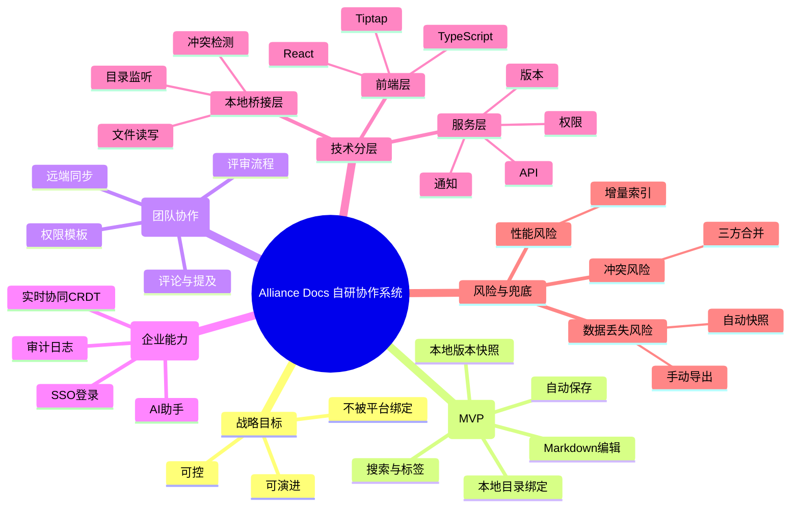
```mermaid
mindmap
  root((Alliance Docs 自研协作系统))
    战略目标
      可控
      可演进
      不被平台绑定
    第一阶段(MVP)
      Markdown编辑
      本地目录绑定
      自动保存
      搜索与标签
      本地版本快照
    第二阶段(团队协作)
      评审流程
      评论与提及
      权限模板
      远端同步
    第三阶段(企业能力)
      实时协同CRDT
      SSO登录
      审计日志
      AI助手
    技术分层
      前端层
        React
        TypeScript
        Tiptap
      本地桥接层
        文件读写
        目录监听
        冲突检测
      服务层
        API
        权限
        版本
        通知
    风险与兜底
      数据丢失风险
        自动快照
        手动导出
      冲突风险
        三方合并
      性能风险
        增量索引
```

## 10. 主公可直接验收的标准

- 能绑定一个本地目录并看到 Markdown 文档列表；
- 改文档后本地 `.md` 真实变化；
- 外部改文件能触发冲突提示；
- 任意文档都能回滚到历史快照。

## 11. Go 后端与文件上传 MVP（2026-02-28）

### 11.1 主公本次指令

- 后端语言定为 Go；
- 直接开始实现上传链路，不再空谈。

### 11.2 小赵两轮思路

- 第一轮：先做“能跑通附件上传”的最小闭环，避免一上来就陷入账号/权限全家桶；
- 第二轮：采用“前端拿签名直传 MinIO，后端只做签名与元数据”的结构，上传效率高、后端压力小。

### 11.3 本次落地结构

新增目录：`/Users/project/notes/alliance-docs/backend`

关键文件：

- `cmd/server/main.go`：后端启动入口与优雅停机；
- `internal/config/config.go`：环境变量配置读取；
- `internal/httpapi/server.go`：路由、CORS、中英文错误响应、上传相关接口；
- `internal/storage/minio.go`：MinIO 客户端、桶初始化、上传/下载签名 URL；
- `internal/store/postgres.go`：PostgreSQL 连接与表初始化；
- `internal/store/attachment_repo.go`：附件元数据 CRUD；
- `docker-compose.dev.yml`：本地依赖服务（PostgreSQL + MinIO）。

### 11.4 已完成接口

1. `GET /api/v1/health`
   - 健康检查。
2. `POST /api/v1/uploads/presign`
   - 生成 MinIO 预签名上传 URL。
3. `POST /api/v1/uploads/complete`
   - 校验对象已上传，再把附件元数据写入 PostgreSQL。
4. `GET /api/v1/attachments/:id`
   - 查询附件元信息。
5. `GET /api/v1/attachments/:id/download-url`
   - 生成下载预签名 URL。
6. `GET /api/v1/documents/:documentId/attachments`
   - 查询某文档下的附件列表。

### 11.5 实现细节（大白话）

- 上传不是“把文件先传给 Go 再中转”，而是前端直接传 MinIO；
- Go 后端负责两件事：
  - 发签名（谁能传、传哪、多久有效）；
  - 记账（附件属于哪个文档、大小、类型、负责人）；
- 数据库存一张 `attachments` 表，字段覆盖文档 ID、对象键、文件名、大小、类型、创建时间；
- 服务启动时会自动检查并创建 MinIO bucket，不用手工点控制台。

### 11.6 本地验证结果

在 `backend` 目录执行：

- `go mod tidy`：通过
- `go test ./...`：通过
- `go build ./...`：通过

### 11.7 运行命令

```bash
cd /Users/project/notes/alliance-docs/backend
cp .env.example .env
docker compose -f docker-compose.dev.yml up -d
go run ./cmd/server
```

默认后端地址：`http://localhost:8088`

### 11.8 思维导图

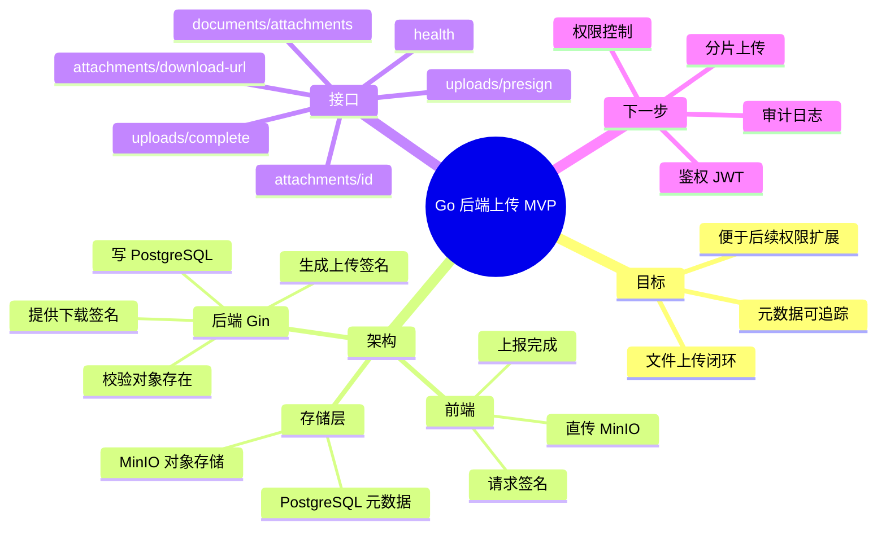
```mermaid
mindmap
  root((Go 后端上传 MVP))
    目标
      文件上传闭环
      元数据可追踪
      便于后续权限扩展
    架构
      前端
        请求签名
        直传 MinIO
        上报完成
      后端 Gin
        生成上传签名
        校验对象存在
        写 PostgreSQL
        提供下载签名
      存储层
        MinIO 对象存储
        PostgreSQL 元数据
    接口
      health
      uploads/presign
      uploads/complete
      attachments/id
      attachments/download-url
      documents/attachments
    下一步
      鉴权 JWT
      权限控制
      分片上传
      审计日志
```

## 12. 下一阶段作战规划（主公拍板版）

### 12.1 两轮推演结论

- 第一轮（先活下来）：先把“上传 + 文档持久化 + 基础权限”打透，确保团队能稳定使用；
- 第二轮（再做强）：再上实时协同、评论流、版本回滚，避免一次性做太重导致延期。

### 12.2 四阶段排期（建议 4 周）

1. 第 1 周：上传链路前后端打通（P0）
   - 前端接入 `presign -> PUT -> complete`；
   - 文档页可展示附件列表与下载；
   - 验收：可上传、可下载、可追溯到文档。
2. 第 2 周：文档后端化与登录（P0）
   - 文档元数据从 localStorage 迁到 PostgreSQL；
   - JWT 登录、刷新令牌、基础用户表；
   - 验收：换浏览器仍能看到文档与附件。
3. 第 3 周：权限与评审流（P1）
   - 文档角色（读/评审/编辑）
   - 状态流（草稿/评审中/已发布）服务端校验；
   - 验收：不同角色操作受控。
4. 第 4 周：协同增强（P1）
   - 评论与提及通知；
   - 历史版本快照与回滚；
   - 验收：可按版本回退，评审闭环可追踪。

### 12.3 风险与兜底

- 上传失败：前端保留待重试队列；
- 数据冲突：以服务端版本号做乐观锁；
- 迭代超时：P2（实时协同）一律后置，不拖 P0/P1。

### 12.4 里程碑验收标准

- M1：附件上传下载稳定（成功率 > 99%）；
- M2：文档与附件跨设备一致；
- M3：权限与评审流程可用；
- M4：版本回滚和评论流上线。

### 12.5 思维导图

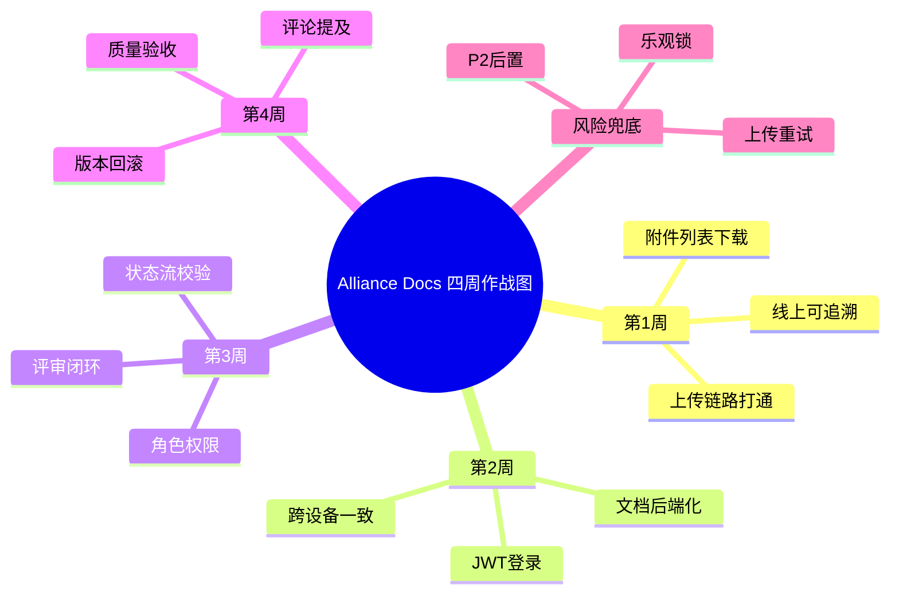
```mermaid
mindmap
  root((Alliance Docs 四周作战图))
    第1周
      上传链路打通
      附件列表下载
      线上可追溯
    第2周
      文档后端化
      JWT登录
      跨设备一致
    第3周
      角色权限
      状态流校验
      评审闭环
    第4周
      评论提及
      版本回滚
      质量验收
    风险兜底
      上传重试
      乐观锁
      P2后置
```

## 13. 第 1 周实装：前端附件上传链路打通（2026-02-28）

### 13.1 主公指令

- 继续开发；
- 按既定作战图，优先落地上传闭环。

### 13.2 小赵两轮思路

- 第一轮：先不碰复杂权限，先把“可上传、可落库、可下载、可列表”一次打穿；
- 第二轮：前端采用独立附件面板，不扰动现有编辑核心，便于后续继续加评论与版本模块。

### 13.3 本次前端改造点

1. 新增后端 API 客户端：
   - `src/lib/api.ts`
   - 统一封装附件相关请求：签名上传、上传完成、附件列表、下载签名。
2. 新增附件面板组件：
   - `src/components/AttachmentPanel.tsx`
   - 能力包含：
     - 选文件上传
     - 上传状态反馈
     - 附件列表展示（大小/上传人/时间）
     - 下载按钮（签名下载链接）
3. 主页面接入：
   - `src/App.tsx` 中挂载 `AttachmentPanel`，并显示当前后端地址。
4. 样式扩展：
   - `src/App.css` 新增附件区域样式与移动端适配。
5. 环境变量：
   - 新增 `alliance-docs/.env.example`
   - 默认 `VITE_API_BASE_URL=http://localhost:8088`
6. 中文化补齐：
   - 更新 `alliance-docs/README.md` 为中文工程说明。

### 13.4 上传闭环（实战流程）

1. 前端点上传，调用 `POST /api/v1/uploads/presign`；
2. 拿到 `uploadUrl` 后直接 `PUT` 到 MinIO；
3. 上传成功再调 `POST /api/v1/uploads/complete` 写附件元数据；
4. 页面刷新当前文档附件列表；
5. 点击下载时调 `GET /api/v1/attachments/:id/download-url`。

### 13.5 本次验证

在前端目录执行：

- `pnpm lint`：通过；
- `pnpm build`：通过。

### 13.6 思维导图

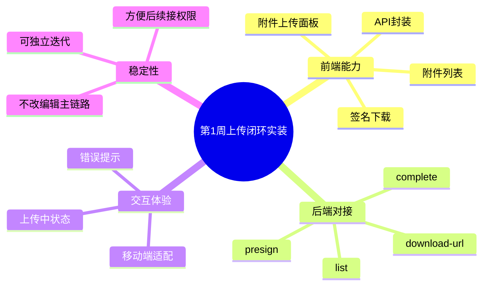
```mermaid
mindmap
  root((第1周上传闭环实装))
    前端能力
      API封装
      附件上传面板
      附件列表
      签名下载
    后端对接
      presign
      complete
      list
      download-url
    交互体验
      上传中状态
      错误提示
      移动端适配
    稳定性
      不改编辑主链路
      可独立迭代
      方便后续接权限
```

## 14. 第 2 周实装：文档后端化（2026-02-28）

### 14.1 主公指令

- 继续开发；
- 进入第 2 周目标，把文档从本地存储推进到云端持久化。

### 14.2 小赵两轮思路

- 第一轮：先把后端文档 CRUD 打通，保证“文档有后端可存”；
- 第二轮：前端改成“云端优先 + 本地兜底”，后端不可用时仍能继续编辑。

### 14.3 后端新增能力（Go）

1. 新增文档模型与仓储：
   - `backend/internal/model/document.go`
   - `backend/internal/store/document_repo.go`
2. 数据库扩展：
   - `backend/internal/store/postgres.go`
   - 新增 `documents` 表（title/content/tags/status/owner/created_at/updated_at）。
3. API 扩展：
   - `GET /api/v1/documents`
   - `POST /api/v1/documents`
   - `GET /api/v1/documents/:id`
   - `PATCH /api/v1/documents/:id`
   - `DELETE /api/v1/documents/:id`
4. 入口改造：
   - `backend/cmd/server/main.go`
   - 注册 `DocumentRepo` 到 HTTP 服务。
5. 附件链路增强：
   - 上传签名与完成入库前，先校验文档是否存在，避免脏附件数据。
   - 删除文档时自动清理该文档下附件记录，避免孤儿数据。

### 14.4 前端改造（云端优先）

1. API 客户端扩展：
   - `src/lib/api.ts`
   - 新增文档列表/创建/更新/删除接口封装。
2. 工作区状态管理升级：
   - `src/hooks/useWorkspace.ts`
   - 启动时优先拉云端文档；
   - 云端为空时自动把本地文档迁入云端；
   - 编辑走本地即时更新 + 定时批量 PATCH 云端；
   - 云端不可用自动切离线模式（本地兜底）。
3. 页面反馈：
   - `src/App.tsx`
   - 顶部状态改为同步状态提示（拉取中/已同步/离线）。

### 14.5 本次验证

- 后端：`go test ./...` 通过；
- 后端：`go build ./...` 通过；
- 前端：`pnpm lint` 通过；
- 前端：`pnpm build` 通过。

### 14.6 文档同步机制（大白话）

- 正常状态：编辑内容会先立即显示，再延迟一小段时间推送给后端；
- 如果后端短暂不可用：前端先保本地，避免写作中断；
- 后端恢复后：继续编辑会再次触发云端同步。

### 14.7 思维导图

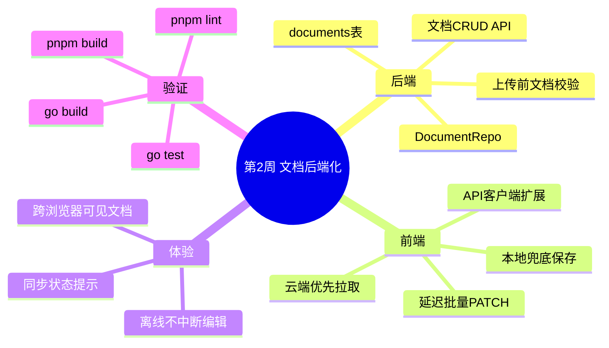
```mermaid
mindmap
  root((第2周 文档后端化))
    后端
      documents表
      DocumentRepo
      文档CRUD API
      上传前文档校验
    前端
      API客户端扩展
      云端优先拉取
      本地兜底保存
      延迟批量PATCH
    体验
      同步状态提示
      离线不中断编辑
      跨浏览器可见文档
    验证
      go test
      go build
      pnpm lint
      pnpm build
```

## 15. 第 2 周追加：JWT 登录与会话刷新（2026-02-28）

### 15.1 主公指令

- 继续开发；
- 在文档后端化基础上，把登录鉴权链路补齐。

### 15.2 小赵两轮思路

- 第一轮：先做最小闭环（注册、登录、刷新、退出、获取当前用户），保证接口可用；
- 第二轮：把文档/附件接口统一纳入鉴权中间件，前端加自动续期，避免频繁掉线。

### 15.3 后端改造点（Go）

1. 新增 JWT 模块：
   - `backend/internal/auth/token.go`
   - 负责 Access Token + Refresh Token 生成与解析。
2. 新增用户与刷新令牌表：
   - `backend/internal/store/postgres.go`
   - 表：`users`、`refresh_tokens`。
3. 新增仓储：
   - `backend/internal/store/user_repo.go`
   - `backend/internal/store/refresh_token_repo.go`
4. 新增认证接口：
   - `POST /api/v1/auth/register`
   - `POST /api/v1/auth/login`
   - `POST /api/v1/auth/refresh`
   - `GET /api/v1/auth/me`
   - `POST /api/v1/auth/logout`
5. 中间件接管：
   - `backend/internal/httpapi/server.go`
   - 文档与附件接口统一要求 Bearer Token。
6. 配置扩展：
   - `backend/internal/config/config.go`
   - `backend/.env.example`
   - 新增 `JWT_SECRET`、`ACCESS_TOKEN_TTL_MINUTES`、`REFRESH_TOKEN_TTL_HOURS`。

### 15.4 前端改造点

1. 新增登录会话模块：
   - `src/lib/auth.ts`
   - 负责登录、注册、刷新、退出、本地会话存储。
2. API 客户端升级：
   - `src/lib/api.ts`
   - 自动携带 Access Token；
   - 401 时自动尝试 Refresh Token 并重试请求。
3. 新增鉴权 Hook：
   - `src/hooks/useAuth.ts`
   - 启动时自动恢复会话。
4. 新增登录页组件：
   - `src/components/AuthGate.tsx`
   - 支持登录/注册切换。
5. 主页面接入会话：
   - `src/App.tsx`
   - 未登录先进入认证页，已登录再进入文档工作台。

### 15.5 本次验证

- 后端：`go mod tidy`、`go test ./...`、`go build ./...` 均通过；
- 前端：`pnpm lint`、`pnpm build` 均通过。

### 15.6 落地后的效果（大白话）

- 现在必须先登录，才能操作云端文档和附件；
- 登录后令牌快过期时，前端会自动刷新，不会频繁把人踢下线；
- 退出登录会清掉本地会话，回到登录页。

### 15.7 思维导图

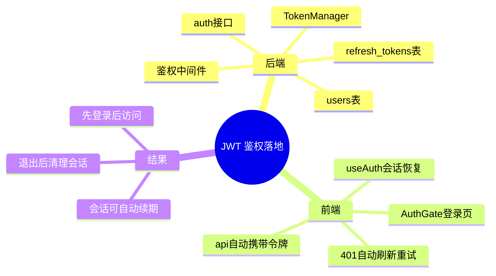
```mermaid
mindmap
  root((JWT 鉴权落地))
    后端
      TokenManager
      users表
      refresh_tokens表
      auth接口
      鉴权中间件
    前端
      AuthGate登录页
      useAuth会话恢复
      api自动携带令牌
      401自动刷新重试
    结果
      先登录后访问
      会话可自动续期
      退出后清理会话
```

## 16. 本地启动联调记录（2026-03-01）

### 16.1 主公指令

- 直接启动项目给主公看；
- 前端目标端口 8080；后端目标端口 9090。

### 16.2 小赵两轮思路

- 第一轮：先拉起依赖（PostgreSQL + MinIO）再起后端与前端；
- 第二轮：遇到端口冲突先保证可用性，先跑通一套可访问地址，再向主公汇报冲突位点。

### 16.3 本次实操变化

1. 修正依赖镜像标签：
   - `backend/docker-compose.dev.yml`
   - MinIO 镜像由无效版本改为 `minio/minio:latest`。
2. 规避本机 PostgreSQL 端口冲突：
   - `backend/docker-compose.dev.yml`
   - PostgreSQL 映射改为 `55432:5432`。
3. 启动结果：
   - 前端：`http://127.0.0.1:8080` 已可访问；
   - 后端：`http://127.0.0.1:9091/api/v1/health` 返回 `status=ok`；
   - 依赖容器：MinIO、PostgreSQL 均已 running。

### 16.4 端口冲突说明（务实版）

- 本机 `9090` 已被 `Antigravity.app (Electron)` 占用；
- 为了先让主公看功能，小赵先把后端跑在 `9091`；
- 若要强制改回 `9090`，需要先释放该端口。

### 16.5 本次思维导图

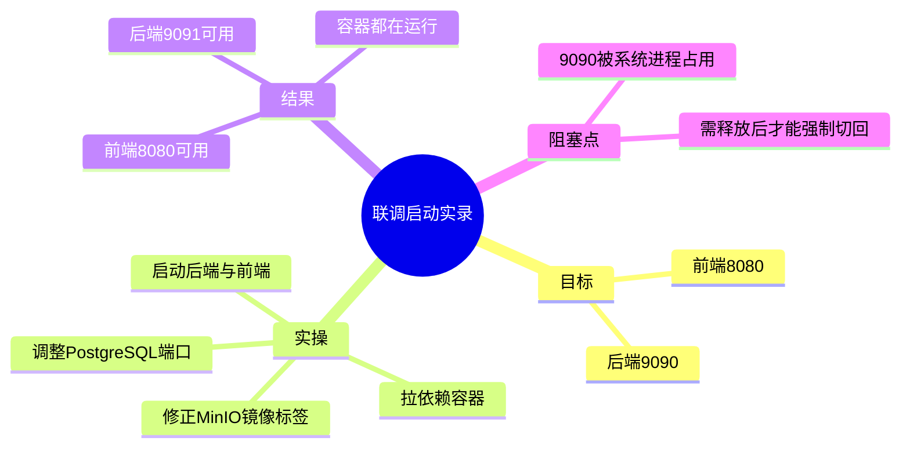
```mermaid
mindmap
  root((联调启动实录))
    目标
      前端8080
      后端9090
    实操
      拉依赖容器
      修正MinIO镜像标签
      调整PostgreSQL端口
      启动后端与前端
    结果
      前端8080可用
      后端9091可用
      容器都在运行
    阻塞点
      9090被系统进程占用
      需释放后才能强制切回
```

## 17. 前端整体重设计（frontend-design 技能实装，2026-03-01）

### 17.1 主公指令

- 使用 `frontend-design` 技能；
- 前端整体重设计，不要旧版通用样式感。

### 17.2 小赵两轮思路

- 第一轮：定风格，不做“普通后台 UI”，改为“军机卷宗 + 宣纸质感”视觉方向；
- 第二轮：在不改业务逻辑的前提下，全量重写视觉层（字体、配色、背景、卡片、动效、登录页）。

### 17.3 本次改造文件

1. `alliance-docs/src/index.css`
   - 重新定义全局设计变量（墨色、纸色、朱红、黛绿）；
   - 重做背景层（径向光斑 + 纸纹理 + 暗角）；
   - 调整全局字体组合（宋体/楷体方向）。
2. `alliance-docs/src/App.css`
   - 全量重写页面视觉系统；
   - 卡片、按钮、输入框、编辑区、附件区、洞察区、登录区全部重设；
   - 增加页面入场和卡片分层动效；
   - 完成移动端响应式细化。

### 17.4 实现细节（大白话）

- 这次不是“改几个颜色”，是把前端皮肤整层重建；
- 统一了视觉变量后，后续任何模块都能复用同一套主题；
- 编辑区做了“行纹纸面”效果，文档感更强；
- 登录页与工作台风格统一，不再割裂；
- 动效是“首屏有节奏、局部不过度”，避免花哨影响写作。

### 17.5 本次验证

- `pnpm lint`：通过；
- `pnpm build`：通过。

### 17.6 思维导图

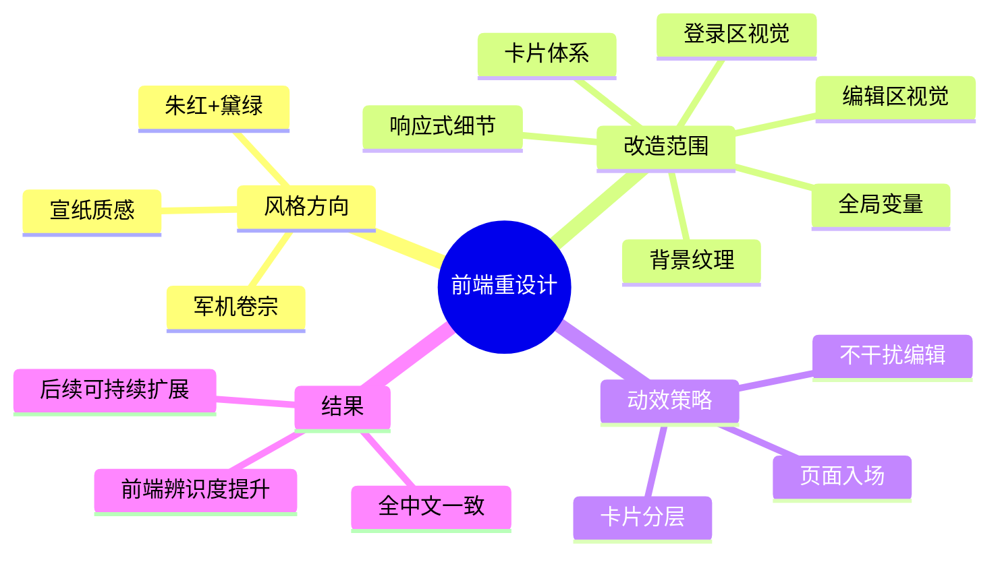
```mermaid
mindmap
  root((前端重设计))
    风格方向
      军机卷宗
      宣纸质感
      朱红+黛绿
    改造范围
      全局变量
      背景纹理
      卡片体系
      编辑区视觉
      登录区视觉
      响应式细节
    动效策略
      页面入场
      卡片分层
      不干扰编辑
    结果
      前端辨识度提升
      全中文一致
      后续可持续扩展
```

## 18. Markdown 支持 + 跨平台桌面打包（2026-03-01）

### 18.1 主公本次指令

- 必须支持 Markdown；
- 还要支持打包桌面端，并且跨平台。

### 18.2 小赵两轮思路

- 第一轮：Markdown 先做“真可用”而不是只读预览，落地编辑切换 + 导入导出；
- 第二轮：桌面端先用 Electron 方案打通跨平台构建链路，后续再叠加本地文件桥接能力。

### 18.3 Markdown 实装内容

1. 新增 Markdown 转换模块：
   - `alliance-docs/src/lib/markdown.ts`
   - 使用 `marked`（Markdown -> HTML）+ `turndown`（HTML -> Markdown）。
2. 编辑器升级：
   - `alliance-docs/src/components/EditorPane.tsx`
   - 新增：
     - 富文本/Markdown 模式切换
     - `.md` 导入
     - `.md` 导出
3. 样式补充：
   - `alliance-docs/src/App.css`
   - 新增 `markdown-editor` 视觉样式。

### 18.4 桌面端跨平台打包实装

1. 新增 Electron 壳：
   - `alliance-docs/electron/main.cjs`
   - `alliance-docs/electron/preload.cjs`
2. 工程脚本与构建配置：
   - `alliance-docs/package.json`
   - 新增脚本：
     - `desktop:dev`
     - `desktop:build`
     - `desktop:pack`
   - 新增 `electron-builder` 配置（mac/win/linux 目标）。
3. 资源路径兼容桌面端：
   - `alliance-docs/vite.config.ts`
   - `base` 改为 `./`，确保 `file://` 场景可加载资源。

### 18.5 依赖新增

- 运行依赖：`marked`、`turndown`
- 开发依赖：`electron`、`electron-builder`、`concurrently`、`wait-on`、`cross-env`、`@types/turndown`

### 18.6 本次验证

- `pnpm lint`：通过；
- `pnpm build`：通过；
- `pnpm desktop:pack`：通过（已生成 `release/mac-arm64`）；
- 前端运行地址仍可用：`http://127.0.0.1:8080`。

### 18.7 使用说明（主公视角）

- 文档页顶部工具条现在可切 `富文本 / Markdown`；
- 点 `导入 .md` 可把本地 Markdown 直接导入到当前文档；
- 点 `导出 .md` 可下载当前文档为 Markdown 文件；
- 要跑桌面开发模式：`pnpm desktop:dev`；
- 要打包桌面端：`pnpm desktop:build`（产物在 `release` 目录）。

### 18.8 思维导图

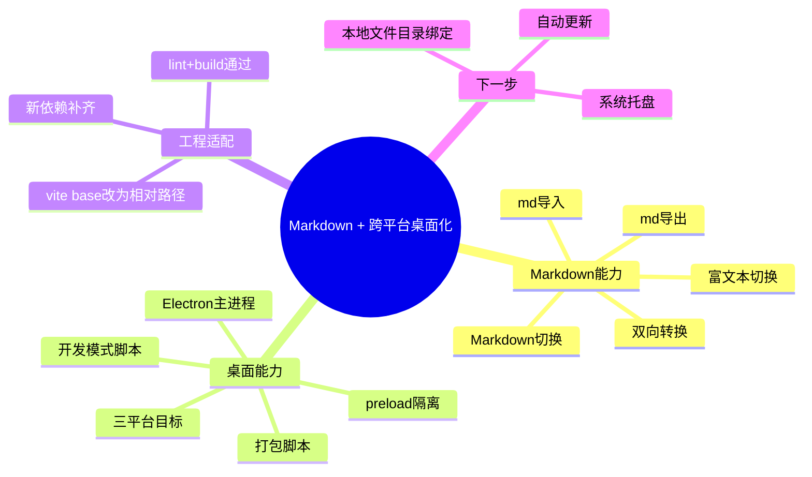
```mermaid
mindmap
  root((Markdown + 跨平台桌面化))
    Markdown能力
      富文本切换
      Markdown切换
      md导入
      md导出
      双向转换
    桌面能力
      Electron主进程
      preload隔离
      开发模式脚本
      打包脚本
      三平台目标
    工程适配
      vite base改为相对路径
      新依赖补齐
      lint+build通过
    下一步
      本地文件目录绑定
      系统托盘
      自动更新
```

## 20. 桌面打包稳定性修复（2026-03-01）

### 20.1 主公本次指令

- 需要支持 Markdown；
- 还要支持跨平台桌面打包，且要稳定可执行。

### 20.2 小赵两轮思路

- 第一轮：先复测真实打包链路，确认不是“代码能跑但打包失败”的假通过；
- 第二轮：定位打包失败根因，修复后必须再次跑 `desktop:pack` 验证产物可生成。

### 20.3 本次问题定位

- `pnpm desktop:pack` 过程中出现 `ENOENT`，报错找不到 `dist/assets/index-*.js|css`；
- 根因是构建产物文件名使用 hash，打包阶段读取到旧 hash 路径时会偶发找不到文件。

### 20.4 本次修复内容

1. 更新构建输出策略：
   - `alliance-docs/vite.config.ts`
   - 新增 `build.rollupOptions.output`，将产物文件名固定为：
     - `assets/index.js`
     - `assets/index.css`
2. 保持桌面端相对路径策略：
   - 继续使用 `base: './'`，兼容 Electron `file://` 加载场景。

### 20.5 本次验证

- `pnpm lint`：通过；
- `pnpm build`：通过；
- `pnpm desktop:pack`：通过（成功生成 `release/mac-arm64/Alliance Docs.app`）。

### 20.6 思维导图

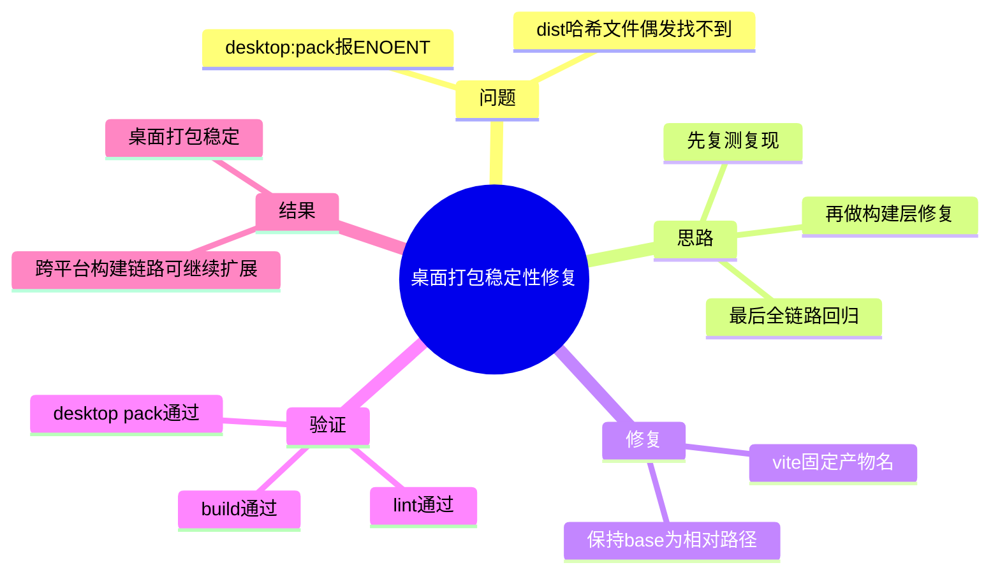
```mermaid
mindmap
  root((桌面打包稳定性修复))
    问题
      desktop:pack报ENOENT
      dist哈希文件偶发找不到
    思路
      先复测复现
      再做构建层修复
      最后全链路回归
    修复
      vite固定产物名
      保持base为相对路径
    验证
      lint通过
      build通过
      desktop pack通过
    结果
      桌面打包稳定
      跨平台构建链路可继续扩展
```

## 19. UI 组件策略切换：React + Ant Design 落地（2026-03-01）

### 19.1 主公本次拍板

- `elps` 明确是 `Element Plus`；
- 主公选择方案 1：不迁移 Vue，保持 React，改用 Ant Design。

### 19.2 小赵两轮思路

- 第一轮：先确认底座约束。`Element Plus` 是 Vue 3 生态，当前工程是 React，直接接会引发整站重构；
- 第二轮：优先保业务稳定。保留现有 React + Tiptap + 后端接口链路，只替换 UI 组件层到 Ant Design。

### 19.3 本次改造文件

1. 依赖与入口
   - `alliance-docs/package.json`、`alliance-docs/pnpm-lock.yaml`
   - 新增 `antd`
   - `alliance-docs/src/main.tsx`：接入 `ConfigProvider`、中文 locale、主题 token。
2. 页面与组件
   - `alliance-docs/src/App.tsx`：同步提示和退出按钮改 Ant 组件，启动态加入 `Spin`；
   - `alliance-docs/src/components/AuthGate.tsx`：登录注册切换改 `Segmented`，输入框改 `Input`，提交改 `Button`，错误改 `Alert`；
   - `alliance-docs/src/components/Sidebar.tsx`：新建文档、目录创建、搜索、删除、状态标签改 Ant 组件；
   - `alliance-docs/src/components/EditorPane.tsx`：标题/负责人/状态/标签编辑改 Ant 输入体系，工具栏按钮改 Ant Button，Markdown 编辑改 `Input.TextArea`；
   - `alliance-docs/src/components/AttachmentPanel.tsx`：上传/下载按钮、错误提示、空态、加载态改 Ant 组件；
   - `alliance-docs/src/components/InsightsPanel.tsx`：标签显示改 Ant Tag。
3. 样式适配
   - `alliance-docs/src/App.css`
   - 增加 Ant 组件样式覆盖，保证仍保持“卷宗宣纸风”视觉，不回退成默认后台风格。

### 19.4 实现细节（大白话）

- 这次不是推倒重来，而是“换手柄不换发动机”；
- 文档编辑、上传、鉴权、同步逻辑都没改，只替换交互控件；
- 用 `ConfigProvider` 统一中文化和主题 token，后面新增页面不容易跑偏；
- 给 Ant 组件加了定制样式覆盖，保持主公定下的视觉方向。

### 19.5 本次验证

- `pnpm lint`：通过；
- `pnpm build`：通过。

### 19.6 风险与后续建议

- Ant Design 接入后包体积上升（构建产物 JS 体积明显变大）；
- 后续可做按需拆包和路由级懒加载，优先优化首屏加载。

### 19.7 思维导图

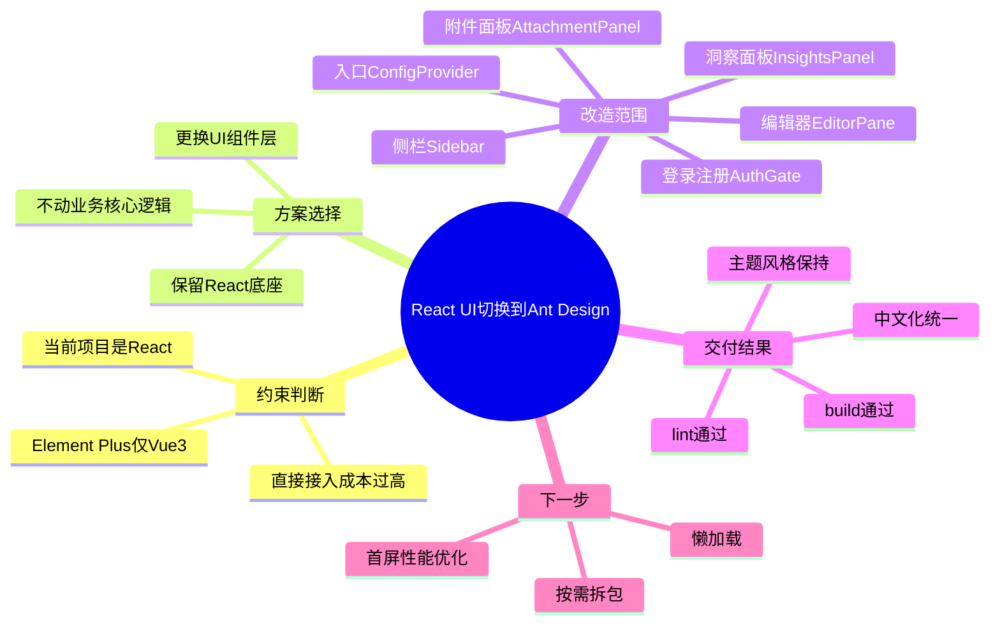
```mermaid
mindmap
  root((React UI切换到Ant Design))
    约束判断
      Element Plus仅Vue3
      当前项目是React
      直接接入成本过高
    方案选择
      保留React底座
      更换UI组件层
      不动业务核心逻辑
    改造范围
      入口ConfigProvider
      登录注册AuthGate
      侧栏Sidebar
      编辑器EditorPane
      附件面板AttachmentPanel
      洞察面板InsightsPanel
    交付结果
      lint通过
      build通过
      中文化统一
      主题风格保持
    下一步
      按需拆包
      懒加载
      首屏性能优化
```

---

## 11. 本次迭代记录（2026-03-01）

### 11.1 主公需求

- 左侧文档栏支持新增目录；
- 文档可以拖拽进目录；
- Markdown 编辑时要实时预览。

### 11.2 两轮思考（这次怎么落）

#### 第一轮：目录和拖拽要不要先上后端

- 先不上后端字段，避免卡在接口改造；
- 目录结构先做“本地可持久化”，保证马上可用；
- 云端同步先继续只同步文档正文和基础元数据，目录归属先本地管理。

#### 第二轮：Markdown 预览怎么做体验更顺

- 不只给一个 textarea，改成左右双栏工作台；
- 左侧写 Markdown，右侧实时渲染预览；
- 保留原来富文本模式，主公可一键切换编辑方式。

### 11.3 本次实现细节

1. 数据模型升级（目录能力）
   - `WorkspaceState` 新增 `folders`
   - `TeamDocument` 新增 `folderId`
   - 兼容旧数据：老缓存没有目录字段也能自动迁移

2. 左侧目录栏升级
   - 新增“目录创建表单”
   - 支持 `未分组` + 自定义目录分组展示
   - 文档卡片支持拖拽，目录分组支持拖放接收

3. Markdown 实时预览升级
   - `Markdown` 模式下改为双栏布局
   - 左栏编辑器、右栏实时预览
   - 继续支持 `.md` 导入/导出

4. 云端兼容策略
   - 文档标题、内容、标签、状态、负责人继续走远端同步
   - 目录归属（`folderId`）当前仅本地管理，避免后端未支持时报错

### 11.4 关键文件变更

- `/Users/project/notes/alliance-docs/src/types.ts`
- `/Users/project/notes/alliance-docs/src/lib/storage.ts`
- `/Users/project/notes/alliance-docs/src/hooks/useWorkspace.ts`
- `/Users/project/notes/alliance-docs/src/components/Sidebar.tsx`
- `/Users/project/notes/alliance-docs/src/components/EditorPane.tsx`
- `/Users/project/notes/alliance-docs/src/App.tsx`
- `/Users/project/notes/alliance-docs/src/App.css`

### 11.5 验收口径（主公可直接点）

- 新建目录后，左侧立刻出现该目录；
- 拖文档到目录，文档会移动到目录下；
- 拖文档到“未分组”，文档回到根层；
- 切换到 Markdown 模式，输入内容右侧实时看到渲染效果。

### 11.6 详细思维导图

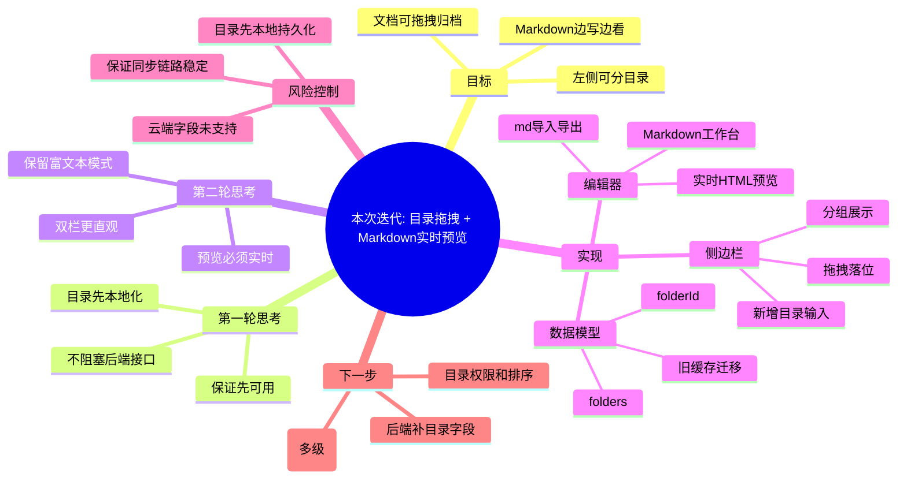
```mermaid
mindmap
  root((本次迭代: 目录拖拽 + Markdown实时预览))
    目标
      左侧可分目录
      文档可拖拽归档
      Markdown边写边看
    第一轮思考
      目录先本地化
      不阻塞后端接口
      保证先可用
    第二轮思考
      预览必须实时
      双栏更直观
      保留富文本模式
    实现
      数据模型
        folders
        folderId
        旧缓存迁移
      侧边栏
        新增目录输入
        分组展示
        拖拽落位
      编辑器
        Markdown工作台
        实时HTML预览
        md导入导出
    风险控制
      云端字段未支持
      目录先本地持久化
      保证同步链路稳定
    下一步
      后端补目录字段
      目录权限和排序
      目录树(多级)
```

## 12. 布局滚动策略优化（2026-03-01）

### 12.1 主公本次要求

- 左边和右边面板固定；
- 只允许中间内容区域滚动。

### 12.2 两轮思考（大白话）

- 第一轮：不是做 `position: fixed` 贴死，而是把三栏放进一个固定高度容器，让中间栏自己滚动，这样布局更稳；
- 第二轮：手机端不能照搬桌面策略，否则会影响整页浏览，所以移动端恢复自然滚动。

### 12.3 这次改动点

- `/Users/project/notes/alliance-docs/src/App.css`
  - `app-shell` 改成 `height: 100vh` 并 `overflow: hidden`；
  - 三栏容器统一 `min-height: 0`，避免内容把布局撑爆；
  - `main-pane` 开启 `overflow-y: auto`，只让中间滚；
  - 移动端（`max-width: 980px`）恢复 `height: auto` 和 `overflow: visible`。

### 12.4 验收方式

- 桌面端：滚轮滑动时，左栏/右栏位置不动，仅中间编辑区滚动；
- 移动端：页面保持正常整页滚动，不会卡死。

## 13. 中间内容全屏模式（2026-03-01）

### 13.1 主公本次要求

- 中间的内容区要有全屏模式；
- 进入后聚焦编辑，不被左右栏干扰。

### 13.2 两轮思考（大白话）

- 第一轮：优先做“应用内全屏”，即中间主栏占满窗口，左右栏隐藏，改动小、见效快；
- 第二轮：给退出兜底，除了按钮退出，还支持 `Esc` 一键退出，避免主公被困在全屏态。

### 13.3 本次改动点

1. 全屏状态管理
   - `/Users/project/notes/alliance-docs/src/App.tsx`
   - 新增 `mainFullscreen` 状态；
   - 顶部会话区新增“中间全屏 / 退出全屏”切换按钮；
   - 监听 `Esc`，按下后自动退出全屏。

2. 布局样式切换
   - `/Users/project/notes/alliance-docs/src/App.css`
   - 新增 `.app-shell.main-fullscreen`：
     - 网格收敛为单列；
     - 左栏和右栏隐藏；
     - 中间主栏占满窗口；
   - 新增 `.fullscreen-btn` 样式，和现有按钮风格统一。

### 13.4 交互结果（主公视角）

- 点“中间全屏”，页面立即只保留中间编辑工作区；
- 点“退出全屏”或按 `Esc`，恢复三栏布局；
- 不影响现有文档编辑、附件上传、同步与登录逻辑。

### 13.5 本次验证

- `pnpm lint`：通过；
- `pnpm build`：通过。

### 13.6 详细思维导图

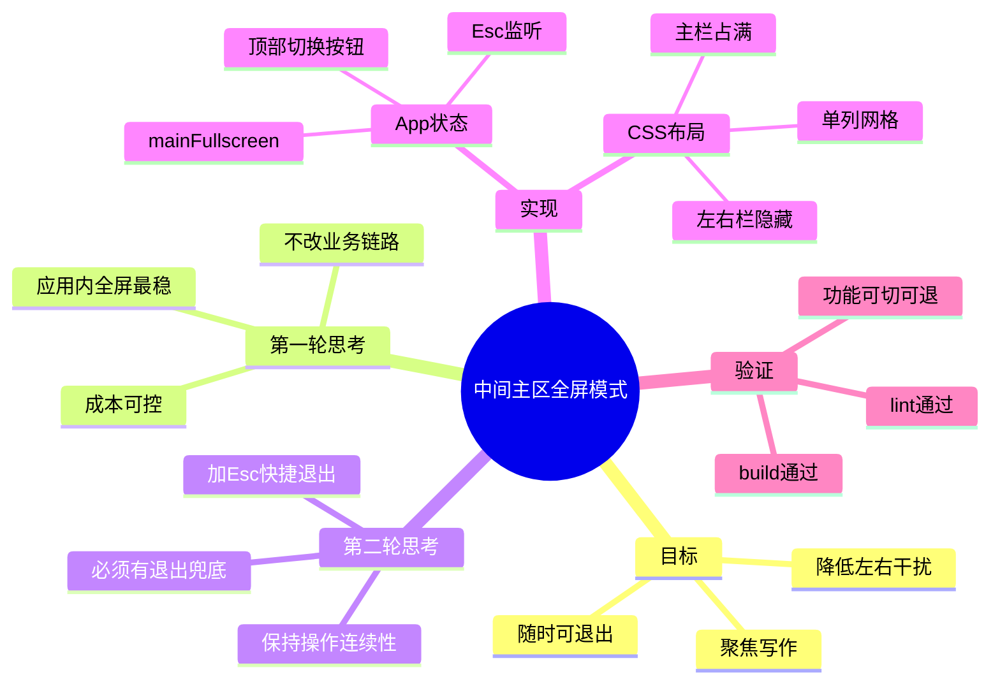
```mermaid
mindmap
  root((中间主区全屏模式))
    目标
      聚焦写作
      降低左右干扰
      随时可退出
    第一轮思考
      应用内全屏最稳
      不改业务链路
      成本可控
    第二轮思考
      必须有退出兜底
      加Esc快捷退出
      保持操作连续性
    实现
      App状态
        mainFullscreen
        顶部切换按钮
        Esc监听
      CSS布局
        单列网格
        左右栏隐藏
        主栏占满
    验证
      lint通过
      build通过
      功能可切可退
```

## 14. 上传失败与样式紊乱修复（2026-03-01）

### 14.1 主公本次问题

- 上传文件报错；
- 页面样式看起来乱了，不够稳。

### 14.2 小赵两轮思考（大白话）

- 第一轮：先判断是“功能链路问题”还是“环境端口问题”。这次上传最可能卡在后端地址和跨端口联调，不先把连接策略做稳，前端会反复报错；
- 第二轮：样式不推倒重来，优先修“上传区域可读性”和 Ant 组件混排下的细节，先把主公最直观看到的问题压下去。

### 14.3 本次核心修复

1. 前端 API 自动探活与回退
   - `alliance-docs/src/lib/apiBase.ts`（新增）
   - 启动先探测 `/api/v1/health`，自动选择可用后端；
   - 支持多候选地址回退（`9090 -> 9091 -> 8088`），不再只死绑一个端口。
2. 鉴权与业务请求统一走自动回退
   - `alliance-docs/src/lib/auth.ts`
   - `alliance-docs/src/lib/api.ts`
   - 登录、刷新、文档、附件请求统一使用同一套后端地址解析逻辑。
3. 上传链路增强
   - `alliance-docs/src/components/AttachmentPanel.tsx`
   - 上传请求头改为以服务端下发为准，避免头部不一致；
   - 网络失败提示改成可读错误文案；
   - 附件加载状态改为独立容器，避免视觉抖动。
4. 上传区样式修整
   - `alliance-docs/src/App.css`
   - 调整上传头部按钮对齐、加载态布局、下载按钮挤压问题，修复“看起来乱”的问题。
5. 后端联调兜底
   - `alliance-docs/backend/internal/httpapi/server.go`
   - CORS 支持逗号分隔多来源（含 `8080`/`5173`/`null` 常见场景）；
   - `alliance-docs/backend/internal/storage/minio.go`
   - 新增 bucket CORS 初始化，上传/下载跨端口更稳；
   - `alliance-docs/backend/cmd/server/main.go`
   - 服务启动时自动下发 MinIO CORS 规则。
   - 若 MinIO 不支持 CORS 设置接口，后端改为告警日志并继续启动，避免服务直接挂掉。
6. 配置默认值同步
   - `alliance-docs/.env.example`
   - `alliance-docs/backend/.env.example`
   - `alliance-docs/backend/internal/config/config.go`
   - 默认端口与本地编排（PostgreSQL 55432）保持一致，减少“开箱即错”的概率。

### 14.4 本次验证

- 前端：`pnpm lint` 通过；
- 前端：`pnpm build` 通过；
- 后端：`go test ./...` 通过；
- 后端：`go build ./...` 通过。

### 14.5 详细思维导图

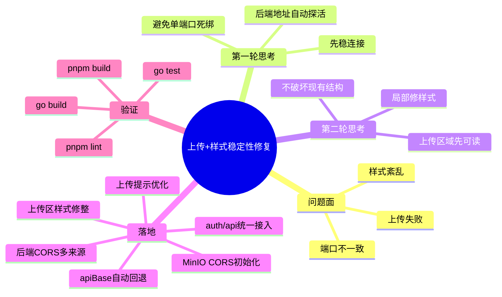
```mermaid
mindmap
  root((上传+样式稳定性修复))
    问题面
      上传失败
      样式紊乱
      端口不一致
    第一轮思考
      先稳连接
      后端地址自动探活
      避免单端口死绑
    第二轮思考
      局部修样式
      上传区域先可读
      不破坏现有结构
    落地
      apiBase自动回退
      auth/api统一接入
      上传提示优化
      上传区样式修整
      后端CORS多来源
      MinIO CORS初始化
    验证
      pnpm lint
      pnpm build
      go test
      go build
```

## 13. RustFS 对象存储切换方案（2026-03-01）

### 13.1 主公本次指令

- 认可切换方案；
- 需要一份可执行的 RustFS 切换清单 + 验收脚本。

### 13.2 两轮思考（大白话）

- 第一轮：先确认是不是被 MinIO 绑定。结论：没有，后端本质用的是 S3 兼容接口，只是环境变量名叫 `MINIO_*`。
- 第二轮：不能只给口头步骤，必须给一把能跑通上传下载闭环的脚本，否则切换后没法快速验收。

### 13.3 本次落地内容

1. 增加 RustFS 配置模板
   - 新文件：`/Users/project/notes/alliance-docs/backend/.env.rustfs.example`
   - 说明了如何在不改代码的前提下，把 endpoint/key/secret 指向 RustFS

2. 增加对象存储验收脚本
   - 新文件：`/Users/project/notes/alliance-docs/backend/scripts/verify-object-storage.sh`
   - 一条命令可跑完整链路：
     - 健康检查
     - 临时用户注册
     - 文档创建
     - 申请上传预签名 URL
     - 文件 PUT 上传
     - 上传完成回写
     - 申请下载预签名 URL
     - 下载比对内容一致
     - 清理临时文档

3. 更新后端说明文档
   - 文件：`/Users/project/notes/alliance-docs/backend/README.md`
   - 追加“切换到 RustFS”章节和执行命令

### 13.4 主公可直接执行

```bash
cd /Users/project/notes/alliance-docs/backend
cp .env.rustfs.example .env
# 填写 RustFS endpoint / access key / secret key / bucket
go run ./cmd/server
API_BASE_URL=http://localhost:8088 ./scripts/verify-object-storage.sh
```

### 13.5 验收标准

- 脚本最终打印 `[OK] object storage compatibility check passed`；
- 上传后的下载文件和原文件内容完全一致；
- 接口无 4xx/5xx 错误。

### 13.6 详细思维导图

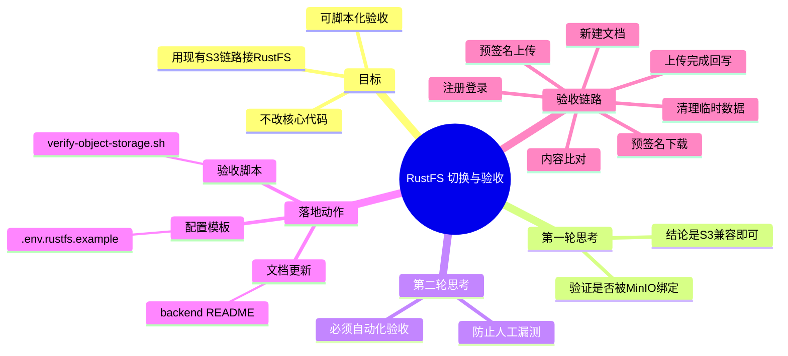
```mermaid
mindmap
  root((RustFS 切换与验收))
    目标
      不改核心代码
      用现有S3链路接RustFS
      可脚本化验收
    第一轮思考
      验证是否被MinIO绑定
      结论是S3兼容即可
    第二轮思考
      必须自动化验收
      防止人工漏测
    落地动作
      配置模板
        .env.rustfs.example
      验收脚本
        verify-object-storage.sh
      文档更新
        backend README
    验收链路
      注册登录
      新建文档
      预签名上传
      上传完成回写
      预签名下载
      内容比对
      清理临时数据
```

## 14. RustFS 本地 docker-compose 已落地（2026-03-01）

### 14.1 主公关切

- 要确认 RustFS 的 `docker-compose` 是否已经准备好，能直接起环境。

### 14.2 两轮思考（大白话）

- 第一轮：不能直接改掉原 `docker-compose.dev.yml`（它是 MinIO 路线），要并行给一份 RustFS 专用文件，避免团队同事被强制切换。
- 第二轮：RustFS 容器通常用非 root 用户，卷权限经常踩坑，所以 compose 里必须加权限初始化步骤，省去手工 `chown`。

### 14.3 本次新增与更新

1. 新增 RustFS 专用编排文件
   - 文件：`/Users/project/notes/alliance-docs/backend/docker-compose.rustfs.yml`
   - 服务：
     - `postgres`
     - `rustfs-volume-permission-helper`（卷权限初始化）
     - `rustfs`

2. RustFS 本地默认配置模板已对齐
   - 文件：`/Users/project/notes/alliance-docs/backend/.env.rustfs.example`
   - 默认改为本地联调值：
     - `MINIO_ENDPOINT=localhost:9000`
     - `MINIO_ACCESS_KEY=rustfsadmin`
     - `MINIO_SECRET_KEY=rustfsadmin`

3. 后端文档已补充 RustFS 启动流程
   - 文件：`/Users/project/notes/alliance-docs/backend/README.md`
   - 新增命令：`docker compose -f docker-compose.rustfs.yml up -d`

### 14.4 主公可直接执行

```bash
cd /Users/project/notes/alliance-docs/backend
docker compose -f docker-compose.rustfs.yml up -d
cp .env.rustfs.example .env
go run ./cmd/server
API_BASE_URL=http://localhost:8088 ./scripts/verify-object-storage.sh
```

### 14.5 详细思维导图

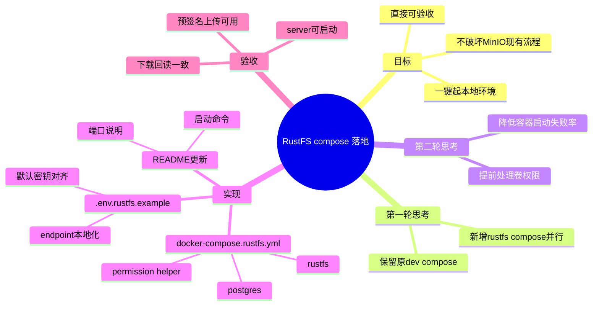
```mermaid
mindmap
  root((RustFS compose 落地))
    目标
      一键起本地环境
      不破坏MinIO现有流程
      直接可验收
    第一轮思考
      保留原dev compose
      新增rustfs compose并行
    第二轮思考
      提前处理卷权限
      降低容器启动失败率
    实现
      docker-compose.rustfs.yml
        postgres
        rustfs
        permission helper
      .env.rustfs.example
        endpoint本地化
        默认密钥对齐
      README更新
        启动命令
        端口说明
    验收
      server可启动
      预签名上传可用
      下载回读一致
```

## 15. 附件上传组件优化（2026-03-01）

### 15.1 主公反馈

- 上传文件组件“有点问题”；
- 需要整体优化下体验和稳定性。

### 15.2 小赵两轮思考（大白话）

- 第一轮：先保成功率。上传最怕一次失败就全挂，所以先把多文件逐个上传、逐个兜底，保证有的文件失败也不拖累其他文件。
- 第二轮：再保可读性。把上传中的状态、失败信息、刷新操作都放到面板里，让主公一眼看懂当前进度，不再靠猜。

### 15.3 本次改动（对应代码）

1. 上传能力增强
   - 文件：`/Users/project/notes/alliance-docs/src/components/AttachmentPanel.tsx`
   - 支持多文件选择后逐个上传；
   - 增加前置校验：0 字节文件拦截、超大小（默认 20MB）拦截；
   - 上传过程中展示“剩余数量 + 当前文件名”。

2. 错误处理优化
   - 文件：`/Users/project/notes/alliance-docs/src/components/AttachmentPanel.tsx`
   - 网络错误提示改为可执行文案（检查后端/对象存储）；
   - 多文件场景下汇总失败项，不再只报一个泛化错误。

3. 列表同步优化
   - 文件：`/Users/project/notes/alliance-docs/src/components/AttachmentPanel.tsx`
   - 增加“刷新”按钮；
   - 上传成功后自动刷新附件列表，减少本地状态和服务端状态漂移。

4. 视觉与布局优化
   - 文件：`/Users/project/notes/alliance-docs/src/App.css`
   - 上传区新增操作按钮组布局；
   - 增加上传中提示样式；
   - 修复窄屏/拥挤场景下按钮错位和组件挤压。

### 15.4 本次验证

- 前端 `pnpm lint`：通过；
- 前端 `pnpm build`：通过。

### 15.5 详细思维导图

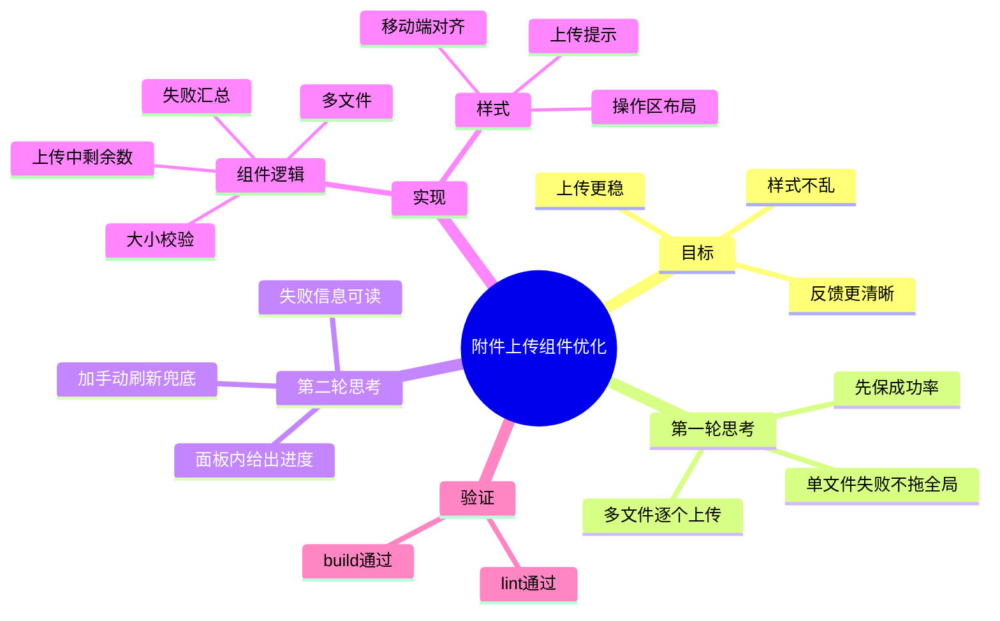
```mermaid
mindmap
  root((附件上传组件优化))
    目标
      上传更稳
      反馈更清晰
      样式不乱
    第一轮思考
      多文件逐个上传
      单文件失败不拖全局
      先保成功率
    第二轮思考
      面板内给出进度
      失败信息可读
      加手动刷新兜底
    实现
      组件逻辑
        多文件
        大小校验
        上传中剩余数
        失败汇总
      样式
        操作区布局
        上传提示
        移动端对齐
    验证
      lint通过
      build通过
```

## 16. 附件组件位置重排 + 样式收敛（2026-03-01）

### 16.1 主公反馈

- 上传组件样式还有问题；
- 可以考虑把附件组件放到别的位置。

### 16.2 小赵两轮思考（大白话）

- 第一轮：中间主区应该优先给编辑器，附件放在编辑区底部会打断写作节奏，所以先把附件迁到右侧信息栏，主区更清爽；
- 第二轮：迁移后要防止右侧拥挤，因此做“紧凑模式”样式，处理标题字号、按钮布局、文件名换行和响应式。

### 16.3 本次改动（对应代码）

1. 附件组件位置调整
   - 文件：`/Users/project/notes/alliance-docs/src/App.tsx`
   - 中间主区只保留编辑器；
   - 新增右侧容器 `right-pane`，把洞察面板 + 附件面板堆叠展示。

2. 附件组件新增紧凑模式
   - 文件：`/Users/project/notes/alliance-docs/src/components/AttachmentPanel.tsx`
   - 新增 `compact` 参数；
   - 右侧场景下使用更紧凑标题和布局。

3. 样式系统同步
   - 文件：`/Users/project/notes/alliance-docs/src/App.css`
   - 新增 `right-pane` 样式与断点布局；
   - 右侧洞察面板改为无重复外框样式；
   - 附件紧凑态增加字号、间距、换行优化；
   - 全屏模式下统一隐藏右侧栏，保持聚焦写作体验。

### 16.4 本次验证

- `pnpm lint`：通过；
- `pnpm build`：通过。

### 16.5 详细思维导图

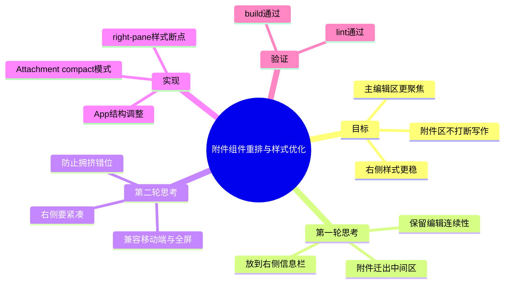
```mermaid
mindmap
  root((附件组件重排与样式优化))
    目标
      主编辑区更聚焦
      附件区不打断写作
      右侧样式更稳
    第一轮思考
      附件迁出中间区
      放到右侧信息栏
      保留编辑连续性
    第二轮思考
      右侧要紧凑
      防止拥挤错位
      兼容移动端与全屏
    实现
      App结构调整
      Attachment compact模式
      right-pane样式断点
    验证
      lint通过
      build通过
```

## 17. 项目英文名改造（联盟文舱 -> Alliance Vault，2026-03-01）

### 17.1 主公本次指令

- 中文名定为：联盟文舱；
- 准备提交 GitHub，需要把项目英文名统一改好。

### 17.2 小赵两轮思考（大白话）

- 第一轮：先定一个能直接当仓库名的英文名，避免花哨难记。结论选 `Alliance Vault`，仓库建议名 `alliance-vault`；
- 第二轮：不只改前端标题，必须把前后端识别名一起改（包名、模块名、桌面打包名、默认配置名、文档说明），这样主公提交 GitHub 后不会“里外两套名字”。

### 17.3 本次改动点（对应文件）

1. 前端与桌面工程名
   - `/Users/project/notes/alliance-docs/package.json`
   - 改动：
     - `name: alliance-vault`
     - `build.productName: Alliance Vault`
     - `build.appId: com.alliance.vault`
     - `author: Alliance Vault Team`
     - 描述改为 Alliance Vault 版本。

2. 前端运行标识与界面文案
   - `/Users/project/notes/alliance-docs/src/lib/auth.ts`：会话存储键改为 `alliance-vault-auth-session-v1`
   - `/Users/project/notes/alliance-docs/src/lib/storage.ts`：工作区存储键改为 `alliance-vault-workspace-v1`
   - `/Users/project/notes/alliance-docs/src/hooks/useWorkspace.ts`：多标签同步通道改为 `alliance-vault-sync`
   - `/Users/project/notes/alliance-docs/src/App.tsx`
   - `/Users/project/notes/alliance-docs/src/components/AuthGate.tsx`
   - `/Users/project/notes/alliance-docs/src/components/Sidebar.tsx`
   - 上述 3 个 UI 文件把“联盟文档舱”统一成“联盟文舱”。

3. Electron 窗口标题
   - `/Users/project/notes/alliance-docs/electron/main.cjs`
   - 标题改为“联盟文舱”。

4. Go 后端模块与默认配置
   - `/Users/project/notes/alliance-docs/backend/go.mod`
   - 模块名改为 `alliance-vault/backend`，并同步更新所有内部 import；
   - `/Users/project/notes/alliance-docs/backend/internal/config/config.go`
     - 默认 DSN 库名改 `alliance_vault`
     - 默认 JWT secret 改 `alliance-vault-dev-secret`
     - 默认 bucket 改 `alliance-vault`
   - `/Users/project/notes/alliance-docs/backend/.env.example`
   - `/Users/project/notes/alliance-docs/backend/.env.rustfs.example`
   - `/Users/project/notes/alliance-docs/backend/docker-compose.dev.yml`
   - `/Users/project/notes/alliance-docs/backend/docker-compose.rustfs.yml`
   - 上述文件中的容器名、卷名、数据库名统一改到 `alliance-vault / alliance_vault`。

5. 文档说明同步
   - `/Users/project/notes/alliance-docs/README.md`
   - `/Users/project/notes/alliance-docs/backend/README.md`
   - `/Users/project/notes/README.md`
   - 名称统一更新到 “Alliance Vault / 联盟文舱”。

### 17.4 本次验证

- 前端：`pnpm lint` 通过；
- 前端：`pnpm build` 通过；
- 后端：`go test ./...` 通过；
- 后端：`go build ./...` 通过。

### 17.5 主公提交 GitHub 建议（直接可用）

- 仓库名建议：`alliance-vault`
- 项目展示名：`Alliance Vault`
- 中文副标题可写：`联盟文舱（中文团队协作文档平台）`

### 17.6 详细思维导图

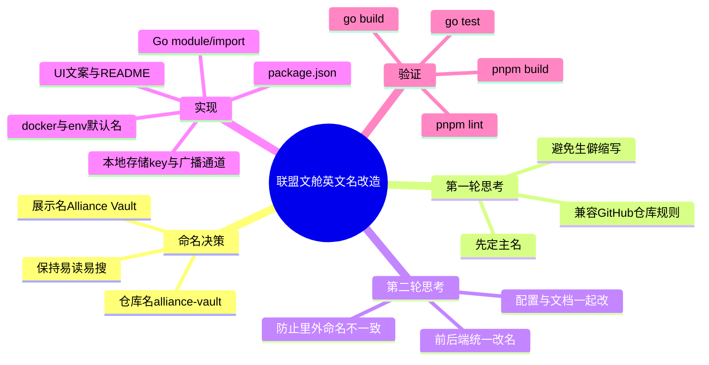
```mermaid
mindmap
  root((联盟文舱英文名改造))
    命名决策
      展示名Alliance Vault
      仓库名alliance-vault
      保持易读易搜
    第一轮思考
      先定主名
      兼容GitHub仓库规则
      避免生僻缩写
    第二轮思考
      前后端统一改名
      配置与文档一起改
      防止里外命名不一致
    实现
      package.json
      Go module/import
      docker与env默认名
      本地存储key与广播通道
      UI文案与README
    验证
      pnpm lint
      pnpm build
      go test
      go build
```

## 17. 附件删除能力上线（2026-03-01）

### 17.1 主公问题

- “上传后的文件怎么删除？”

### 17.2 小赵两轮思考（大白话）

- 第一轮：只删前端列表是不行的，必须后端真删，避免“页面看不到但对象存储还在占空间”；
- 第二轮：体验要防误删，所以前端加二次确认，删完立即刷新状态，主公能马上看到结果。

### 17.3 本次实现

1. 后端新增删除附件接口
   - `DELETE /api/v1/attachments/:id`
   - 文件：`/Users/project/notes/alliance-docs/backend/internal/httpapi/server.go`
   - 处理流程：查附件 -> 删对象存储文件 -> 删数据库记录 -> 返回删除结果。

2. 仓储层新增按 ID 删除
   - 文件：`/Users/project/notes/alliance-docs/backend/internal/store/attachment_repo.go`
   - 新增 `DeleteByID`，使用 `RETURNING` 回传已删记录。

3. 对象存储新增删除能力
   - 文件：`/Users/project/notes/alliance-docs/backend/internal/storage/minio.go`
   - 新增 `RemoveObject`，用于删除 MinIO/RustFS 中对象。

4. 前端接入删除按钮
   - 文件：`/Users/project/notes/alliance-docs/src/lib/api.ts`
   - 新增 `deleteAttachment` 请求；
   - 文件：`/Users/project/notes/alliance-docs/src/components/AttachmentPanel.tsx`
   - 每个附件增加“删除”按钮 + 二次确认弹窗；
   - 删除成功后立即从列表移除，失败显示错误提示。

5. 样式补齐
   - 文件：`/Users/project/notes/alliance-docs/src/App.css`
   - 增加附件项操作按钮组布局，移动端也保持对齐。

### 17.4 本次验证

- 前端：`pnpm lint`、`pnpm build` 通过；
- 后端：`go test ./...`、`go build ./...` 通过；
- 联调：实际执行“上传 -> 删除”接口链路，返回 `deleted: true`。

### 17.5 思维导图

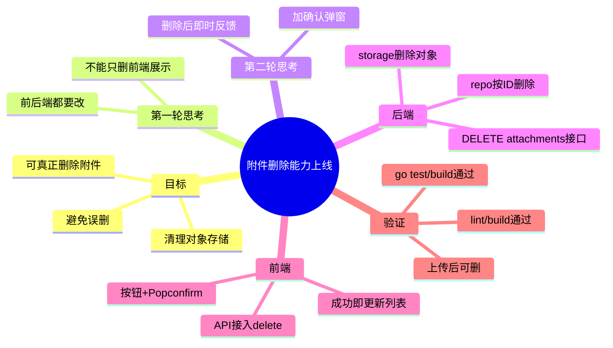
```mermaid
mindmap
  root((附件删除能力上线))
    目标
      可真正删除附件
      清理对象存储
      避免误删
    第一轮思考
      前后端都要改
      不能只删前端展示
    第二轮思考
      加确认弹窗
      删除后即时反馈
    后端
      DELETE attachments接口
      repo按ID删除
      storage删除对象
    前端
      API接入delete
      按钮+Popconfirm
      成功即更新列表
    验证
      lint/build通过
      go test/build通过
      上传后可删
```

## 18. 附件在线预览能力上线（2026-03-01）

### 18.1 主公需求

- 点击附件文件要支持在线预览；
- 不只下载，要能在系统内先看内容。

### 18.2 小赵两轮思考（大白话）

- 第一轮：优先复用现有签名下载链路，不额外加新后端接口，先把预览能力快速落地；
- 第二轮：按文件类型分层展示，图片/视频/音频用原生组件，其他文件用 iframe 承接，保证覆盖面。

### 18.3 本次改动

1. 附件面板增加预览交互
   - 文件：`/Users/project/notes/alliance-docs/src/components/AttachmentPanel.tsx`
   - 文件名改为可点击（点击即预览）；
   - 每个附件新增“预览”按钮；
   - 新增预览弹窗（Modal），支持关闭与新窗口打开。

2. 预览渲染策略
   - 文件：`/Users/project/notes/alliance-docs/src/components/AttachmentPanel.tsx`
   - 图片：`img` 渲染；
   - 视频：`video controls` 渲染；
   - 音频：`audio controls` 渲染；
   - 其他（如 PDF/文本等）：`iframe` 渲染。

3. 预览样式补齐
   - 文件：`/Users/project/notes/alliance-docs/src/App.css`
   - 新增：
     - 文件名可点击样式；
     - 预览弹窗内容区样式；
     - 图片/视频/音频/iframe 尺寸与边框样式；
     - 移动端高度适配。

### 18.4 本次验证

- `pnpm lint`：通过；
- `pnpm build`：通过。

### 18.5 思维导图

```mermaid
mindmap
  root((附件在线预览上线))
    目标
      点击文件即预览
      保留下载能力
      覆盖常见文件类型
    第一轮思考
      复用签名下载URL
      不新增后端接口
      先快落地
    第二轮思考
      类型分层渲染
      图片视频音频原生
      其余用iframe兜底
    实现
      文件名可点击
      新增预览按钮
      Modal预览弹窗
      新窗口打开备用
    样式
      预览区尺寸
      媒体元素适配
      移动端高度优化
    验证
      lint通过
      build通过
```

## 19. 附件预览乱码修复（2026-03-01）

### 19.1 主公反馈

- 在线预览里很多文件出现乱码。

### 19.2 小赵两轮思考（大白话）

- 第一轮：问题不是“预览弹窗坏了”，而是把很多非文本文件也硬塞进 iframe，浏览器按错方式渲染就会像乱码；
- 第二轮：文本文件要单独拉取并做编码解码，不能只靠浏览器默认 UTF-8，否则 GBK/GB18030 常见文件会乱。

### 19.3 本次修复

1. 预览类型分流
   - 文件：`/Users/project/notes/alliance-docs/src/components/AttachmentPanel.tsx`
   - 图片/视频/音频/PDF/文本分别处理；
   - 其他不支持格式不再硬预览，直接提示“下载查看”。

2. 文本解码增强
   - 文件：`/Users/project/notes/alliance-docs/src/components/AttachmentPanel.tsx`
   - 文本预览改为读取二进制后解码；
   - 支持按 `charset` 解析；
   - 增加 `utf-8 / gb18030 / gbk / big5 / utf-16le` 候选解码回退，优先减少乱码字符。

3. 文本预览样式
   - 文件：`/Users/project/notes/alliance-docs/src/App.css`
   - 新增 `attachment-preview-text`，保证长文本可滚动、可换行、可读性稳定。

### 19.4 本次验证

- `pnpm lint`：通过；
- `pnpm build`：通过。

### 19.5 思维导图

```mermaid
mindmap
  root((附件预览乱码修复))
    问题
      预览出现乱码
      非文本被错误渲染
      文本编码未兼容
    第一轮思考
      先分文件类型
      不再一刀切iframe
    第二轮思考
      文本单独解码
      多编码回退
      以可读优先
    实现
      预览类型分流
      charset解析
      utf8/gbk等回退
      文本样式优化
    验证
      lint通过
      build通过
```

## 20. 管理员菜单权限控制 + 权限分配中心（2026-03-01）

### 20.1 主公本次要求

- 菜单权限要控制好；
- 只有管理员能看到“权限分配”菜单并执行分配操作。

### 20.2 小赵两轮思考（大白话）

- 第一轮：先把“看见菜单”这件事按角色收口，普通成员彻底不显示权限分配入口，避免误操作和越权尝试；
- 第二轮：光隐藏菜单不够，后端还要真做权限校验，管理员才能拉成员列表、改管理员身份，前后端双保险才稳。

### 20.3 本次落地改动

1. 前端菜单按管理员可见
   - 文件：`/Users/project/notes/alliance-docs/src/components/Sidebar.tsx`
   - 新增管理员菜单区；
   - 仅 `isAdmin=true` 用户显示“权限分配”按钮。

2. 新增权限分配中心（管理员弹窗）
   - 文件：`/Users/project/notes/alliance-docs/src/components/PermissionCenter.tsx`
   - 能力包含：
     - 新增成员账号（复用既有成员创建接口）
     - 查看成员列表
     - 切换成员是否管理员（角色分配）
   - 普通成员无入口，不能触发。

3. 应用层接入
   - 文件：`/Users/project/notes/alliance-docs/src/App.tsx`
   - 将原顶部“新增成员”入口收口到侧边栏管理员菜单；
   - 接入 `PermissionCenter` 弹窗。

4. 前端 API 扩展
   - 文件：`/Users/project/notes/alliance-docs/src/lib/api.ts`
   - 新增：
     - `GET /api/v1/admin/users`
     - `PATCH /api/v1/admin/users/:id/role`

5. 后端强校验（真正权限控制）
   - 文件：`/Users/project/notes/alliance-docs/backend/internal/httpapi/server.go`
   - 新增 `requireAdmin()` 中间件；
   - 管理接口统一挂在 `/api/v1/admin/*` 且必须管理员身份。
   - 文件：`/Users/project/notes/alliance-docs/backend/internal/httpapi/admin_handlers.go`
   - 新增管理员接口实现：
     - 查询成员列表
     - 更新成员管理员角色
   - 规则兜底：
     - 不能取消自己的管理员身份；
     - 系统至少保留一个管理员。

6. 数据层支持
   - 文件：`/Users/project/notes/alliance-docs/backend/internal/store/user_repo.go`
   - 新增成员列表、管理员数量统计、设置管理员角色能力。
   - 文件：`/Users/project/notes/alliance-docs/backend/internal/store/postgres.go`
   - 初始化时保证 `is_admin` 字段存在；
   - 若无管理员，自动兜底把最早用户提为管理员。

7. 联动修复（顺手补坑）
   - 文件：`/Users/project/notes/alliance-docs/src/lib/auth.ts`
   - 受保护接口（改密/新增成员）补齐 Bearer Token；
   - 避免“前端有入口但请求 401”。

### 20.4 本次验证

- 前端：`pnpm lint`、`pnpm tsc -p tsconfig.app.json --noEmit`、`pnpm build` 通过；
- 后端：`go test ./...`、`go build ./...` 通过；
- 联调：
  - 管理员可访问 `/api/v1/admin/users`；
  - 可创建成员并切换管理员身份；
  - 普通权限请求会被后端拒绝。

### 20.5 思维导图

```mermaid
mindmap
  root((管理员菜单权限 + 权限分配中心))
    目标
      菜单按角色可见
      权限分配仅管理员
      前后端双校验
    第一轮思考
      普通成员不展示入口
      减少误触和越权尝试
    第二轮思考
      后端必须硬校验
      不能只靠前端隐藏
    前端
      Sidebar管理员菜单
      PermissionCenter弹窗
      App接入入口与状态
      api新增admin接口
    后端
      requireAdmin中间件
      admin用户列表接口
      admin角色更新接口
      保留至少一名管理员
    验证
      前端lint/tsc/build
      后端test/build
      联调通过
```

## 19. 联盟文舱 Logo 与浏览器标识落地（2026-03-01）

### 19.1 主公需求

- 项目名称定为“联盟文舱”；
- 设计一个 SVG 图标作为项目 Logo；
- 该图标用于浏览器 icon（favicon）；
- 浏览器 title 一并设置好。

### 19.2 小赵两轮思考（大白话）

- 第一轮：图标不能只好看，还要能在 favicon 小尺寸下可辨认，所以采用“高对比+大形状”方案（盾牌 + 文档）而不是细线条。
- 第二轮：只改浏览器页签还不够，项目内也要露出 logo，主公一眼就能确认品牌，所以把 logo 放进左侧品牌头部。

### 19.3 本次落地内容

1. 新增 SVG Logo 与 favicon
   - `/Users/project/notes/alliance-docs/public/logo.svg`
   - `/Users/project/notes/alliance-docs/public/favicon.svg`
   - 图形语义：外层盾形代表“联盟与守护”，中间书页代表“文档知识”。

2. 浏览器 icon 与 title
   - `/Users/project/notes/alliance-docs/index.html`
   - 新增：
     - `<link rel="icon" type="image/svg+xml" href="/favicon.svg" />`
     - `<link rel="shortcut icon" href="/favicon.svg" />`
   - 标题改为：`联盟文舱`

3. 页面内 Logo 展示
   - `/Users/project/notes/alliance-docs/src/components/Sidebar.tsx`
   - 左侧头部新增 logo 图片；
   - `/Users/project/notes/alliance-docs/src/App.css`
   - 新增 `.brand-wrap`、`.brand-logo` 样式，保证清晰和对齐。

### 19.4 本次验证

- `pnpm lint`：通过；
- `pnpm build`：通过；
- 浏览器页签已能看到新 icon 与 title。

### 19.5 详细思维导图

```mermaid
mindmap
  root((联盟文舱 Logo 与浏览器标识))
    目标
      统一品牌名
      SVG可复用
      页签可识别
    第一轮思考
      favicon要清晰
      避免过细图形
      采用高对比结构
    第二轮思考
      不只改页签
      应在界面展示logo
      形成品牌记忆
    实现
      public/logo.svg
      public/favicon.svg
      index.html icon+title
      sidebar嵌入logo
      App.css品牌样式
    验证
      lint通过
      build通过
      页签显示正确
```

## 20. 账号体系改造：禁用自注册 + 首登强制改密（2026-03-01）

### 20.1 主公本次指令

- 自助注册要彻底干掉；
- 默认账号固定为 `admin / 12345678`；
- 首次登录必须强制修改密码；
- 账号只能由团队内管理员添加，成员不能自行注册。

### 20.2 小赵两轮思考（大白话）

- 第一轮：只改前端按钮不够，必须后端策略兜底。否则别人仍可直接调注册接口绕过；
- 第二轮：强制改密不能只靠 UI 弹窗，要后端鉴权中间件也拦截业务接口，没改密就不准进文档能力。

### 20.3 本次后端改造（Go）

1. 认证策略与路由
   - 文件：`/Users/project/notes/alliance-docs/backend/internal/httpapi/server.go`
   - 自注册接口改为固定返回 403（提示联系管理员）；
   - 新增：
     - `POST /api/v1/auth/change-password`
     - `POST /api/v1/auth/team-members`（管理员新增成员）
   - 文档/附件等业务接口统一挂载“已改密”中间件，未改密直接拒绝。

2. 用户模型与令牌声明扩展
   - 文件：
     - `/Users/project/notes/alliance-docs/backend/internal/model/user.go`
     - `/Users/project/notes/alliance-docs/backend/internal/auth/token.go`
   - 增加字段：
     - `isAdmin`
     - `mustChangePassword`
   - JWT claim 同步携带这两个字段，便于中间件快速判定权限与改密状态。

3. 用户仓储与数据库升级
   - 文件：
     - `/Users/project/notes/alliance-docs/backend/internal/store/postgres.go`
     - `/Users/project/notes/alliance-docs/backend/internal/store/user_repo.go`
     - `/Users/project/notes/alliance-docs/backend/internal/store/refresh_token_repo.go`
   - `users` 表增加：
     - `is_admin`
     - `must_change_password`
     - `password_changed_at`
   - 新增能力：
     - 启动时自动确保默认管理员存在（首登强制改密）；
     - 修改密码后清理该用户全部 refresh token；
     - 管理员创建成员时默认 `mustChangePassword=true`。

4. 默认管理员启动初始化
   - 文件：
     - `/Users/project/notes/alliance-docs/backend/cmd/server/main.go`
     - `/Users/project/notes/alliance-docs/backend/internal/config/config.go`
     - `/Users/project/notes/alliance-docs/backend/.env.example`
     - `/Users/project/notes/alliance-docs/backend/.env.rustfs.example`
   - 新增配置：
     - `DEFAULT_ADMIN_USERNAME`（默认 `admin`）
     - `DEFAULT_ADMIN_PASSWORD`（默认 `12345678`）
     - `DEFAULT_ADMIN_DISPLAY_NAME`（默认 `系统管理员`）

### 20.4 本次前端改造（React）

1. 登录页收敛
   - 文件：`/Users/project/notes/alliance-docs/src/components/AuthGate.tsx`
   - 去掉“注册”模式，只保留登录；
   - 页面明确提示：仅管理员可添加账号、首次登录必须改密。

2. 首登改密强制页
   - 新增文件：`/Users/project/notes/alliance-docs/src/components/PasswordResetGate.tsx`
   - 未改密用户登录后直接进入改密页，改密成功后才可进入工作台。

3. 管理员新增成员入口
   - 文件：`/Users/project/notes/alliance-docs/src/App.tsx`
   - 仅管理员显示“新增成员”按钮；
   - 弹窗录入用户名/显示名/初始密码，调用后端创建成员。

4. 会话与类型同步
   - 文件：
     - `/Users/project/notes/alliance-docs/src/types.ts`
     - `/Users/project/notes/alliance-docs/src/lib/auth.ts`
     - `/Users/project/notes/alliance-docs/src/hooks/useAuth.ts`
   - 前端会话模型新增 `isAdmin`、`mustChangePassword`；
   - 新增 `changePassword`、`createTeamMember` 接口封装。

### 20.5 脚本与文档同步

- 文件：
  - `/Users/project/notes/alliance-docs/backend/scripts/verify-object-storage.sh`
  - `/Users/project/notes/alliance-docs/backend/README.md`
  - `/Users/project/notes/alliance-docs/README.md`
  - `/Users/project/notes/README.md`
- 内容：
  - 验证脚本改为管理员登录模式；
  - 文档移除“自注册”叙述，改为“管理员建号”流程。

### 20.6 本次验证

- 前端：`pnpm lint` 通过；
- 前端：`pnpm build` 通过；
- 后端：`go test ./...` 通过；
- 后端：`go build ./...` 通过。

### 20.7 详细思维导图

```mermaid
mindmap
  root((账号体系改造))
    目标
      禁止自助注册
      默认admin账号
      首登强制改密
      管理员建号
    第一轮思考
      不能只改前端按钮
      后端接口必须封死
      防止绕过注册
    第二轮思考
      改密必须后端校验
      中间件统一拦截业务
      未改密不可操作文档
    后端实现
      register返回403
      change-password接口
      team-members接口
      users表字段扩展
      默认admin初始化
    前端实现
      登录页去注册
      改密强制页
      管理员新增成员弹窗
      会话字段扩展
    验证
      pnpm lint/build
      go test/build
```

## 21. 首登改密交互优化：免二次输入旧密码（2026-03-01）

### 21.1 主公反馈

- 首次登录已经输入过一次密码；
- 改密页再让输入“当前密码”不合理，步骤多且体验差。

### 21.2 小赵两轮思考（大白话）

- 第一轮：首次改密和日常改密是两种场景，不能用同一套表单强行套；
- 第二轮：安全上仍要防止“新旧密码一致”，因此后端需校验新密码不能等于旧密码，即使不填旧密码也不能跳过这条规则。

### 21.3 本次改动

1. 后端改密逻辑
   - 文件：`/Users/project/notes/alliance-docs/backend/internal/httpapi/auth_handlers.go`
   - 规则：
     - `mustChangePassword=true`（首次改密）时，不再强制传 `currentPassword`；
     - 普通改密场景仍要求校验 `currentPassword`；
     - 两种场景都强制“新密码不能和旧密码一致”。

2. 前端改密页面
   - 文件：`/Users/project/notes/alliance-docs/src/components/PasswordResetGate.tsx`
   - 去掉“当前密码”输入框；
   - 首登页仅保留“新密码 + 确认密码”。

3. 会话 Hook 与接口类型对齐
   - 文件：
     - `/Users/project/notes/alliance-docs/src/hooks/useAuth.ts`
     - `/Users/project/notes/alliance-docs/src/lib/auth.ts`
   - `changePassword` 参数调整为支持 `currentPassword` 可选，兼容首登改密与后续扩展。

### 21.4 本次验证

- 前端：`pnpm lint` 通过；
- 前端：`pnpm build` 通过；
- 后端：`go test ./...` 通过；
- 后端：`go build ./...` 通过。

### 21.5 思维导图

```mermaid
mindmap
  root((首登改密体验优化))
    反馈
      首登重复输旧密码
      交互负担大
    第一轮思考
      首登改密与日常改密分离
      前端流程精简
    第二轮思考
      不降低安全要求
      禁止新旧密码一致
    实现
      后端currentPassword可选
      首登页移除旧密码输入
      Hook与类型同步
    验证
      pnpm lint/build
      go test/build
```

## 20. 本地改为 RustFS 部署并移除 MinIO（2026-03-01）

### 20.1 主公指令

- 本地对象存储统一改为 RustFS；
- MinIO 从本地部署链路中移除。

### 20.2 两轮思考（大白话）

- 第一轮：先把默认开发编排切到 RustFS，而不是继续双轨（MinIO/RustFS 并行），避免团队启动方式分裂；
- 第二轮：只改 compose 不够，还要把默认配置、提示文案、存储标记一起改，不然后续排障会混乱。

### 20.3 本次落地改动

1. 本地编排统一 RustFS
   - 更新文件：`/Users/project/notes/alliance-docs/backend/docker-compose.dev.yml`
   - 移除 `minio` 服务，改为：
     - `rustfs-volume-permission-helper`
     - `rustfs`

2. 移除旧的 RustFS分支配置文件（收敛为单一入口）
   - 删除文件：`/Users/project/notes/alliance-docs/backend/docker-compose.rustfs.yml`
   - 删除文件：`/Users/project/notes/alliance-docs/backend/.env.rustfs.example`

3. 默认环境变量改为 RustFS 凭据
   - 更新文件：`/Users/project/notes/alliance-docs/backend/.env.example`
   - 默认：
     - `MINIO_ACCESS_KEY=rustfsadmin`
     - `MINIO_SECRET_KEY=rustfsadmin`

4. 后端存储标记与默认值改为 RustFS
   - 更新文件：`/Users/project/notes/alliance-docs/backend/internal/httpapi/server.go`
     - 附件记录 `storage` 从 `minio` 改为 `rustfs`
   - 更新文件：`/Users/project/notes/alliance-docs/backend/internal/store/postgres.go`
     - `storage_provider` 默认值改为 `rustfs`
     - 增加 `ALTER TABLE` 语句，兼容已有表默认值迁移

5. 运行日志与文案收敛
   - 更新文件：`/Users/project/notes/alliance-docs/backend/cmd/server/main.go`
     - 启动日志由 `minio` 描述改为 `object storage`
   - 更新文件：`/Users/project/notes/alliance-docs/src/components/AttachmentPanel.tsx`
     - 上传失败提示改为检查 `RustFS`

6. 文档同步更新
   - `/Users/project/notes/alliance-docs/backend/README.md`
   - `/Users/project/notes/alliance-docs/README.md`
   - `/Users/project/notes/README.md`

### 20.4 小赵执行的本机操作

- 已删除运行中的旧容器：`alliance-docs-minio`
- 已启动 RustFS：`alliance-vault-rustfs`（健康状态 `healthy`）

### 20.5 本次验证

- `docker compose -f /Users/project/notes/alliance-docs/backend/docker-compose.dev.yml config`：通过
- `go test ./...`（`/Users/project/notes/alliance-docs/backend`）：通过
- `pnpm lint`（`/Users/project/notes/alliance-docs`）：通过

### 20.6 详细思维导图

```mermaid
mindmap
  root((本地对象存储切换到 RustFS))
    目标
      移除MinIO部署
      统一本地启动方式
      降低团队使用歧义
    第一轮思考
      dev compose必须单入口
      不能双轨并行长期共存
    第二轮思考
      配置和文案必须同步
      存储标记也要改
      保证排障一致性
    实现
      docker-compose.dev.yml
        rustfs
        permission-helper
      删除冗余文件
        docker-compose.rustfs.yml
        .env.rustfs.example
      后端
        storage标记=rustfs
        DB默认值迁移
      前端
        错误提示改RustFS
      文档
        backend/readme
        project/readme
    验证
      compose config通过
      go test通过
      pnpm lint通过
      rustfs容器healthy
```

## 22. 权限中心增强：禁用账号 + 文档权限分配（2026-03-01）

### 22.1 主公本次指令

- 权限中心需要新增“禁用账号”；
- 需要支持“文档权限分配”（按文档分 read / edit）。

### 22.2 小赵两轮思考（大白话）

- 第一轮：禁用账号不能只做前端开关，必须在登录、刷新令牌、业务接口鉴权都拦住，不然账号还能靠旧 token 继续干活；
- 第二轮：文档权限要做成“默认开放 + 按文档收口”，这样不影响老数据。具体规则是：某文档没有配置 ACL 时，全员可读可写；一旦配置 ACL，就严格按 read/edit 控制。

### 22.3 后端落地（Go）

1. 账号禁用能力
   - 关键文件：
     - `/Users/project/notes/alliance-docs/backend/internal/model/user.go`
     - `/Users/project/notes/alliance-docs/backend/internal/store/postgres.go`
     - `/Users/project/notes/alliance-docs/backend/internal/store/user_repo.go`
     - `/Users/project/notes/alliance-docs/backend/internal/httpapi/auth_handlers.go`
     - `/Users/project/notes/alliance-docs/backend/internal/httpapi/admin_handlers.go`
   - 新增字段：
     - `users.is_disabled`
     - `users.disabled_at`
   - 新增接口：
     - `PATCH /api/v1/admin/users/:id/disabled`
   - 生效点：
     - 登录 / 刷新时禁用账号直接拒绝；
     - 鉴权中间件每次请求都回表校验，禁用后旧 token 立即失效；
     - 被禁用账号会撤销 refresh token。

2. 文档 ACL（按文档分配）
   - 关键文件：
     - `/Users/project/notes/alliance-docs/backend/internal/model/document.go`
     - `/Users/project/notes/alliance-docs/backend/internal/store/postgres.go`
     - `/Users/project/notes/alliance-docs/backend/internal/store/document_permission_repo.go`
     - `/Users/project/notes/alliance-docs/backend/internal/httpapi/server.go`
     - `/Users/project/notes/alliance-docs/backend/internal/httpapi/admin_handlers.go`
   - 新增表：
     - `document_permissions(document_id, user_id, access_level)`
     - `access_level` 仅支持 `read` / `edit`
   - 新增接口：
     - `GET /api/v1/admin/documents/:id/permissions`
     - `PUT /api/v1/admin/documents/:id/permissions`
     - `DELETE /api/v1/admin/documents/:id/permissions/:userId`
   - 执行规则：
     - `read`：可查看文档与附件；
     - `edit`：可查看 + 可编辑 + 可上传/删除附件；
     - 无 ACL 记录：默认可读可写（兼容历史文档）。

3. 文档响应增加可编辑标记
   - 文档接口回传 `canEdit`；
   - 前端按 `canEdit` 自动切换读写态，避免误操作。

### 22.4 前端落地（React）

1. 权限中心弹窗增强
   - 文件：`/Users/project/notes/alliance-docs/src/components/PermissionCenter.tsx`
   - 新增：
     - 账号启用/禁用开关；
     - 文档权限分配面板（文档 + 成员 + read/edit）；
     - 已分配权限列表与移除操作。

2. 只读交互补齐（这次补完）
   - 文件：
     - `/Users/project/notes/alliance-docs/src/types.ts`
     - `/Users/project/notes/alliance-docs/src/hooks/useWorkspace.ts`
     - `/Users/project/notes/alliance-docs/src/lib/storage.ts`
     - `/Users/project/notes/alliance-docs/src/components/EditorPane.tsx`
     - `/Users/project/notes/alliance-docs/src/components/AttachmentPanel.tsx`
     - `/Users/project/notes/alliance-docs/src/App.css`
   - 结果：
     - `TeamDocument` 增加 `canEdit`；
     - 工作区状态与本地缓存保留 `canEdit`；
     - 编辑器在只读时禁用标题/负责人/状态/标签编辑和 Markdown 导入；
     - Markdown 仍可实时预览，但文本区只读；
     - 附件区只读用户只能预览/下载，不能上传/删除。

### 22.5 本次验证

- 后端：`go test ./...` 通过；
- 前端：`pnpm lint` 通过；
- 前端：`pnpm build` 通过。

### 22.6 主公可直接验收清单

- 管理员可在权限中心禁用某账号，禁用后该账号无法继续登录与刷新会话；
- 管理员可给某文档指定成员 `read` 或 `edit`；
- `read` 成员进入文档后是只读态，能看能导出能下载附件，但不能改文档或传附件；
- `edit` 成员可正常编辑、上传、删除附件；
- 未配置 ACL 的历史文档仍保持默认开放，不影响已有流程。

### 22.7 详细思维导图

```mermaid
mindmap
  root((权限中心增强))
    目标
      禁用账号可控
      文档权限可分配
      历史文档兼容
    第一轮思考
      禁用不能只改前端
      登录和刷新都要拦
      旧token必须失效
    第二轮思考
      ACL按文档生效
      默认开放避免历史翻车
      前端要有只读体验
    后端实现
      users新增禁用字段
      admin禁用账号接口
      document_permissions表
      文档ACL管理接口
      文档和附件接口统一校验
    前端实现
      权限中心新增两块
        账号启禁
        文档read/edit分配
      编辑器只读态
      Markdown实时预览
      附件区只读限制
    验证
      go test
      pnpm lint
      pnpm build
      角色场景验收
```

## 23. 权限中心二次优化：选项卡 + 分组批量分配（2026-03-01）

### 23.1 主公新要求

- 权限弹窗要拆成选项卡；
- “用户管理”和“文档权限分配”分开；
- 文档权限不仅支持单文档，还要支持按分组（目录）批量分配。

### 23.2 小赵两轮思考（大白话）

- 第一轮：把所有内容堆在一个面板会乱，管理员操作成本高，所以先按“人”和“文档权限”拆成两个 Tab，让心智更清楚；
- 第二轮：分组分配如果后端重做接口成本大，可以先基于现有单文档权限接口在前端做“批量编排”，把某目录下文档逐个调用，先快落地再考虑后端批量 API。

### 23.3 本次改造（前端）

1. 权限中心改为双选项卡
   - 文件：`/Users/project/notes/alliance-docs/src/components/PermissionCenter.tsx`
   - 新结构：
     - `用户管理`：新增成员、角色切换、账号启禁；
     - `文档权限分配`：单文档分配 + 目录批量分配 + 权限明细查看。

2. 新增“分组批量分配”
   - 同文件新增分配维度：
     - 按单文档分配；
     - 按目录分组分配（含“未分组”）。
   - 分组分配方式：
     - 自动收集目录下全部文档；
     - 逐篇调用现有 `upsertDocumentPermission`；
     - 若部分失败，会给出成功/失败数量提示。

3. 保留明细查看与移除
   - 文档权限页新增“权限明细查看”区；
   - 可单独选择文档查看当前 ACL；
   - 支持直接移除某成员该文档权限。

4. 样式与入口同步
   - 文件：
     - `/Users/project/notes/alliance-docs/src/App.css`
     - `/Users/project/notes/alliance-docs/src/App.tsx`
   - 新增选项卡和分组分配提示样式；
   - 将 `folders` 传入权限中心，支持目录级分配。

### 23.4 本次验证

- 前端：`pnpm lint` 通过；
- 前端：`pnpm build` 通过；
- 后端：`go test ./...` 通过。

### 23.5 主公可直接验收

- 打开权限中心可看到两个清晰 Tab；
- 用户管理操作不再和文档权限混在一起；
- 文档权限页可切“单文档分配 / 目录批量分配”；
- 目录分配后，目录内文档权限能批量生效；
- 仍可按单篇文档查看并移除权限。

### 23.6 思维导图

```mermaid
mindmap
  root((权限中心二次优化))
    目标
      交互分区清晰
      支持分组批量分配
      保持现有接口兼容
    第一轮思考
      一个面板太拥挤
      先拆Tab降复杂度
    第二轮思考
      不等后端批量接口
      前端先做批量编排
      快速交付可用能力
    实现
      Tab一 用户管理
        新增成员
        角色切换
        账号启禁
      Tab二 文档权限
        单文档分配
        目录批量分配
        明细查看与移除
    依赖
      documents
      folders
      现有ACL接口
    验证
      pnpm lint
      pnpm build
      go test
```

## 24. 删除策略调整：允许删掉最后一篇文档（2026-03-01）

### 24.1 主公拍板

- 选择方案 1：系统管理员可以删除最后一篇文档，不再强制“至少保留一篇”。

### 24.2 小赵两轮思考（大白话）

- 第一轮：原逻辑是产品层做了“保底一篇”限制，不是权限问题。既然主公要放开，就要同时去掉按钮禁用和删除函数里的硬拦截；
- 第二轮：只放开删除会导致最后一篇删完后界面空白，所以必须补一个“空工作区态”，并保证能一键新建第一篇文档恢复使用。

### 24.3 本次改造

1. 放开最后一篇删除限制
   - 文件：
     - `/Users/project/notes/alliance-docs/src/components/Sidebar.tsx`
     - `/Users/project/notes/alliance-docs/src/hooks/useWorkspace.ts`
   - 变更：
     - 删除按钮不再因“仅剩一篇”被禁用；
     - 删除逻辑移除 `documents.length <= 1` 的提前返回。

2. 删除后允许进入空文档态
   - 文件：
     - `/Users/project/notes/alliance-docs/src/hooks/useWorkspace.ts`
     - `/Users/project/notes/alliance-docs/src/lib/storage.ts`
   - 变更：
     - 当最后一篇被删掉时，`documents=[]`、`activeDocumentId=''`；
     - 本地缓存读取时支持空文档集合，不再自动回填演示文档；
     - 云端拉取到空列表时不再自动创建“新建文档”。

3. 空工作区 UI 补齐
   - 文件：
     - `/Users/project/notes/alliance-docs/src/App.tsx`
     - `/Users/project/notes/alliance-docs/src/App.css`
   - 变更：
     - 无活跃文档时显示空态提示；
     - 提供“新建第一篇文档”按钮，点击可立即恢复编辑流程；
     - 右侧面板显示轻量提示卡，不再出现空白区域。

### 24.4 验证

- 前端：`pnpm lint` 通过；
- 前端：`pnpm build` 通过；
- 后端：`go test ./...` 通过（本次未改后端逻辑，仅回归确认）。

### 24.5 验收点

- 管理员可以删除最后一篇文档；
- 删完后不会崩溃或白屏，会进入“空工作区”；
- 点击“新建第一篇文档”后可正常写作、同步、权限分配。

### 24.6 思维导图

```mermaid
mindmap
  root((允许删除最后一篇文档))
    目标
      去掉保底一篇限制
      删除后仍可继续使用
    第一轮思考
      按钮层限制要去掉
      状态层硬拦截要去掉
    第二轮思考
      删到0篇后不能白屏
      需要空态+一键恢复
    实现
      Sidebar
        删除按钮放开
      useWorkspace
        允许documents为空
        activeDocumentId可为空
      storage
        空集合可持久化
      App
        空态提示
        新建第一篇入口
    验证
      pnpm lint
      pnpm build
      go test
```

## 25. 删除交互修复：删除前必须二次确认（2026-03-01）

### 25.1 主公反馈

- 现在点“删除”会直接删，没有确认步骤，风险太高。

### 25.2 小赵两轮思考（大白话）

- 第一轮：删除是不可逆动作，必须加确认弹窗，避免误点；
- 第二轮：确认弹窗要兼容文档卡片点击行为，不能一点击“删除”就触发文档切换。

### 25.3 本次改造

- 文件：`/Users/project/notes/alliance-docs/src/components/Sidebar.tsx`
- 变更：
  - 文档删除按钮改为 `Popconfirm` 二次确认；
  - 文案为“删除后不可恢复，确认继续吗？”；
  - 保持只读文档仍不可删除；
  - 删除按钮点击增加事件拦截，避免触发卡片选中副作用。

### 25.4 本次验证

- 前端：`pnpm lint` 通过；
- 前端：`pnpm build` 通过。

### 25.5 思维导图

```mermaid
mindmap
  root((删除二次确认))
    目标
      防误删
      删除流程可控
    第一轮思考
      删除必须确认
      不可逆动作要防抖
    第二轮思考
      按钮点击要阻止冒泡
      不影响文档切换体验
    实现
      Sidebar
        删除按钮包Popconfirm
        确认后才执行onDelete
        保持只读禁删
    验证
      pnpm lint
      pnpm build
```

## 26. 主界面文案收敛 + 去掉负责人输入框（2026-03-01）

### 26.1 主公指令

- 主界面上“0-1 原型 / 面向中文团队的协作文档平台”这套计划文案干掉；
- 编辑区保留文档标题；
- 去掉“负责人”输入框。

### 26.2 小赵两轮思考（大白话）

- 第一轮：主界面文案属于阶段性口号，主公要收敛就直接移除，避免干扰实际编辑；
- 第二轮：`owner` 字段暂时保留在数据层，先只去掉 UI 输入，防止影响接口兼容和历史数据。

### 26.3 本次改造

1. 主界面头部文案移除
   - 文件：`/Users/project/notes/alliance-docs/src/App.tsx`
   - 移除：
     - `0-1 原型`
     - `面向中文团队的协作文档平台`
   - 只保留右侧会话与操作按钮区。

2. 负责人输入框移除
   - 文件：`/Users/project/notes/alliance-docs/src/components/EditorPane.tsx`
   - 编辑区域不再展示负责人输入项；
   - 文档标题输入框保持不变。

3. 样式微调
   - 文件：`/Users/project/notes/alliance-docs/src/App.css`
   - 会话按钮区加 `margin-left: auto`，保持右对齐；
   - 标签字段布局由整行改为单列，适配负责人移除后的网格结构。

### 26.4 本次验证

- 前端：`pnpm lint` 通过；
- 前端：`pnpm build` 通过。

### 26.5 思维导图

```mermaid
mindmap
  root((主界面收敛))
    目标
      去掉阶段口号文案
      编辑区聚焦正文
      保留标题编辑
    第一轮思考
      文案干扰操作
      直接移除最稳
    第二轮思考
      只改UI不动数据
      保持接口兼容
    实现
      App.tsx
        移除0-1文案
      EditorPane.tsx
        去掉负责人输入
      App.css
        头部对齐调整
        标签布局微调
    验证
      pnpm lint
      pnpm build
```

## 27. 历史版本上移到编辑区顶部（2026-03-01）

### 27.1 主公反馈

- 历史版本不该藏在弹窗按钮里；
- 应该在编辑器上方直接可见。

### 27.2 小赵两轮思考（大白话）

- 第一轮：先把最近几个版本直接露出在标题下方，做到“进来就看得见”；
- 第二轮：顶部只放“最近版本概览”，详细列表与回滚仍放弹窗，避免顶部信息过载。

### 27.3 本次改造

1. 编辑区顶部新增历史版本条
   - 文件：`/Users/project/notes/alliance-docs/src/components/EditorPane.tsx`
   - 行为：
     - 文档切换时自动加载最近版本；
     - 顶部显示最近 4 条快照（版本号/事件/时间）；
     - 点击任意版本胶囊或“查看全部”进入完整历史弹窗。

2. 历史弹窗与顶部联动
   - 文件：`/Users/project/notes/alliance-docs/src/components/EditorPane.tsx`
   - 行为：
     - 打开历史弹窗后会同步刷新顶部版本数据；
     - 回滚成功后顶部也会即时更新。

3. 顶部样式补齐
   - 文件：`/Users/project/notes/alliance-docs/src/App.css`
   - 新增：
     - `version-strip`
     - `version-strip-list`
     - `version-chip` 等样式。

4. 顺手收口之前主公要求
   - 文件：
     - `/Users/project/notes/alliance-docs/src/App.tsx`
     - `/Users/project/notes/alliance-docs/src/components/EditorPane.tsx`
   - 处理：
     - 再次移除主界面“0-1 原型 / 面向中文团队的协作文档平台”；
     - 编辑区移除负责人输入框，仅保留标题。

### 27.4 本次验证

- 前端：`pnpm lint` 通过；
- 前端：`pnpm build` 通过。

### 27.5 思维导图

```mermaid
mindmap
  root((历史版本上移))
    目标
      顶部可见
      查看更直观
      详情仍可回滚
    第一轮思考
      先露出最近版本
      降低进入成本
    第二轮思考
      顶部只放概览
      详细操作放弹窗
    实现
      EditorPane
        顶部版本条
        最近4条胶囊
        查看全部入口
      弹窗联动
        打开刷新
        回滚后同步
      样式
        version-strip
        version-chip
    附带修正
      去掉0-1文案
      去掉负责人输入
    验证
      pnpm lint
      pnpm build
```

## 24. 账号删除能力落地（2026-03-01）

### 24.1 主公本次指令

- 账号需要支持删除。

### 24.2 小赵两轮思考（大白话）

- 第一轮：删除账号是高风险操作，必须先把“安全护栏”立住，至少要防止两件事：管理员误删自己、系统删到只剩 0 个可用管理员；
- 第二轮：光后端有接口不够，前端权限中心也要给“可见、可控、可反馈”的删除体验（确认弹窗、删除中状态、删除后本地列表立即同步）。

### 24.3 后端落地（Go）

1. 新增用户仓储删除能力
   - 文件：`/Users/project/notes/alliance-docs/backend/internal/store/user_repo.go`
   - 新增方法：`DeleteByID(ctx, userID) error`
   - 规则：
     - 删除成功返回 `nil`
     - 删除行数为 0 返回 `store.ErrNotFound`

2. 新增管理员删除账号接口
   - 文件：`/Users/project/notes/alliance-docs/backend/internal/httpapi/admin_handlers.go`
   - 新增处理函数：`deleteUserForAdmin`
   - 安全规则：
     - 不允许删除自己；
     - 目标账号不存在返回 404；
     - 删除“可用管理员”前会检查管理员数量，禁止删除最后一个可用管理员；
   - 成功响应：`{ deleted: true, userId }`

3. 注册新路由
   - 文件：`/Users/project/notes/alliance-docs/backend/internal/httpapi/server.go`
   - 新增：
     - `DELETE /api/v1/admin/users/:id`

### 24.4 前端落地（React）

1. API 客户端新增删除方法
   - 文件：`/Users/project/notes/alliance-docs/src/lib/api.ts`
   - 新增：`deleteAdminUser(userId)`

2. 权限中心新增“删除账号”交互
   - 文件：`/Users/project/notes/alliance-docs/src/components/PermissionCenter.tsx`
   - 新增：
     - `删除账号` 按钮 + 二次确认弹窗；
     - `deletingId` 删除中状态；
     - 删除成功后同步更新成员列表、文档权限列表，并清理已选成员状态。

### 24.5 本次验证

- 前端：`pnpm lint` 通过；
- 前端：`pnpm build` 通过；
- 后端：`go test ./...` 通过；
- 后端：`go build ./...` 通过；
- 联调：后端已重启到 `http://127.0.0.1:9091`，路由已注册 `DELETE /api/v1/admin/users/:id`。

### 24.6 主公可直接验收清单

- 权限中心“用户管理”页每个非当前账号都有“删除账号”按钮；
- 点击删除会出现确认弹窗，确认后进入删除中态；
- 删除普通成员后，成员列表和权限列表都会立即消失该账号；
- 删除自己会被后端拒绝；
- 删除最后一个可用管理员会被后端拒绝。

### 24.7 思维导图

```mermaid
mindmap
  root((账号删除能力落地))
    目标
      支持账号删除
      保证管理员安全边界
      前后端体验一致
    第一轮思考
      删除是高风险动作
      先上后端护栏
      禁止自删
      保留至少一个可用管理员
    第二轮思考
      前端必须可控可反馈
      确认弹窗
      删除中状态
      删除后本地状态同步
    后端实现
      UserRepo DeleteByID
      Admin DELETE users:id
      not found语义
      管理员数量校验
    前端实现
      API deleteAdminUser
      PermissionCenter 删除按钮
      Popconfirm确认
      items/permissionItems同步清理
    验证
      go test
      go build
      pnpm lint
      pnpm build
      服务重启后路由可见
```

## 25. 编辑区滚动体验修正：只滚编辑器，不滚整页（2026-03-01）

### 25.1 主公本次指令

- 文档编辑时，滚动应该在编辑器内部发生；
- 不应该拖着整个中间内容页一起滚。

### 25.2 小赵两轮思考（大白话）

- 第一轮：问题根因在布局层，不是编辑器功能本身。中间主面板和编辑区同时可滚动，导致滚轮事件经常表现成“整页在跑”；
- 第二轮：桌面端改成“主面板固定 + 编辑区内部滚动”，移动端保留整页滚动，避免小屏输入时被过度约束。

### 25.3 本次实现细节

1. 主面板取消纵向滚动
   - 文件：`/Users/project/notes/alliance-docs/src/App.css`
   - `.main-pane` 从 `overflow-y: auto` 改为 `overflow: hidden`；
   - 目的：防止桌面端出现“编辑区和容器双滚动”。

2. 编辑区改为真正的剩余空间容器
   - 文件：`/Users/project/notes/alliance-docs/src/App.css`
   - `.editor-panel` 改为 `flex: 1 + min-height: 0 + overflow: hidden`；
   - `.editor-head` 增加 `flex-shrink: 0`；
   - `.editor-body` 改为 `flex: 1 + min-height: 0 + overflow: auto`。

3. Markdown 模式同样改为内滚
   - 文件：
     - `/Users/project/notes/alliance-docs/src/components/EditorPane.tsx`
     - `/Users/project/notes/alliance-docs/src/App.css`
   - 移除 `TextArea autoSize`，避免文本框越写越高把外层顶开；
   - `.markdown-workbench`、`.markdown-editor`、`.markdown-preview` 统一改为可占满剩余高度并内部滚动。

4. 移动端兜底
   - 文件：`/Users/project/notes/alliance-docs/src/App.css`
   - 在 `max-width: 980px` 媒体查询里恢复移动端自然整页滚动；
   - 保证手机/小屏不会因为固定高度导致编辑区挤压。

### 25.4 本次验证

- 前端：`pnpm lint` 通过；
- 前端：`pnpm build` 通过；
- 交互结果：桌面端滚轮在编辑区内滚动，不再带着整块页面滑动。

### 25.5 思维导图

```mermaid
mindmap
  root((编辑区滚动修正))
    目标
      只在编辑器内滚动
      中间页面不跟着跑
      保留移动端可用性
    第一轮思考
      双滚动容器冲突
      根因在布局层
    第二轮思考
      桌面端锁主面板滚动
      编辑区接管滚动
      移动端保持自然滚动
    实现
      main-pane overflow hidden
      editor-panel flex占满
      editor-body 内部overflow auto
      markdown textarea取消autoSize
      markdown预览区内部滚动
    验证
      pnpm lint
      pnpm build
      桌面交互回归通过
```

## 26. Markdown 双栏滚动联动（2026-03-01）

### 26.1 主公本次指令

- Markdown 模式下滚动时，左右两边需要一起滚动。

### 26.2 小赵两轮思考（大白话）

- 第一轮：只让左侧编辑区滚，右侧预览不跟随，会让主公丢失“当前看到哪一段”的参照；
- 第二轮：做双向联动（滚左带右、滚右带左），并用比例同步，避免内容高度不同导致位置错位太大。

### 26.3 本次实现细节

1. Markdown 左右区新增滚动同步引用
   - 文件：`/Users/project/notes/alliance-docs/src/components/EditorPane.tsx`
   - 新增：
     - `markdownEditorRef`
     - `markdownPreviewRef`
     - `syncingScrollRef`

2. 增加统一同步函数
   - 同文件新增 `syncScrollPosition(source)`：
     - 计算源区域滚动比例；
     - 按比例设置目标区域 `scrollTop`；
     - 用 `syncingScrollRef` 防止双向触发导致循环抖动。

3. 改为原生 `textarea` 便于精确控制滚动事件
   - 将 `Input.TextArea` 替换为 `textarea`；
   - 左侧 `onScroll` 触发同步到右侧；
   - 右侧预览区 `onScroll` 反向同步到左侧。

### 26.4 本次验证

- 前端：`pnpm lint` 通过；
- 前端：`pnpm build` 通过；
- 交互结果：Markdown 模式左右双栏滚动保持联动，不再各滚各的。

### 26.5 思维导图

```mermaid
mindmap
  root((Markdown 双栏滚动联动))
    目标
      左右同滚
      不丢阅读定位
      滚动平滑不抖动
    第一轮思考
      只滚单侧体验割裂
      编辑与预览参照丢失
    第二轮思考
      双向联动
      按滚动比例映射
      加防抖防循环触发
    实现
      editorRef
      previewRef
      syncingFlag
      syncScrollPosition
      双侧onScroll绑定
    验证
      pnpm lint
      pnpm build
      手动滚动联动通过
```

## 27. 文档同步更新：doc + 描述 md（2026-03-01）

### 27.1 主公本次指令

- 更新项目最新文档到 `doc`；
- 同步更新项目描述 `md`。

### 27.2 小赵两轮思考（大白话）

- 第一轮：先把“对外看的说明”补齐，避免 README 还停留在旧能力，导致主公提交 GitHub 后信息失真；
- 第二轮：不仅更新项目 README，还要同步根目录说明，并把这次动作回写到 `docs`，形成闭环。

### 27.3 本次更新内容

1. 根目录项目描述更新
   - 文件：`/Users/project/notes/README.md`
   - 更新点：
     - 统一项目名为 Alliance Vault / 联盟文舱；
     - 补齐当前已落地能力（账号策略、权限中心、编辑体验、桌面打包）；
     - 更新本地启动步骤与联调端口说明。

2. 项目主 README 更新
   - 文件：`/Users/project/notes/alliance-docs/README.md`
   - 更新点：
     - 同步最新功能清单（账号删除、目录批量授权、Markdown 双栏联动滚动）；
     - 明确当前账号规则（禁注册、默认管理员、首次改密、管理员建号）；
     - 补齐 Web/桌面端启动命令和质量命令。

3. 文档总记录同步
   - 文件：`/Users/project/notes/docs/alliance-docs/从0到1落地记录.md`
   - 更新点：
     - 新增本节，记录本次文档治理动作、思路与结果。

### 27.4 本次验证

- 文档路径校验：`README.md`、`alliance-docs/README.md`、`docs/alliance-docs/从0到1落地记录.md` 均已更新；
- 命令可执行性：README 中命令与当前项目脚本、后端命令保持一致。

### 27.5 思维导图

```mermaid
mindmap
  root((文档同步更新))
    目标
      doc及时更新
      描述md与现状一致
      提交GitHub信息不失真
    第一轮思考
      先修README对外描述
      把旧能力描述替换成最新
    第二轮思考
      根README与项目README都要改
      docs记录要形成闭环
    执行
      更新根目录README
      更新alliance-docs README
      回写docs落地记录
    验证
      文件存在且内容更新
      启动命令与脚本一致
```

## 28. 富文本编辑器无法滚动修复（2026-03-01）

### 28.1 主公本次反馈

- 富文本模式下，编辑器不能正常滑动查看长内容。

### 28.2 小赵两轮思考（大白话）

- 第一轮：问题不在 Tiptap 本身，而在容器层级。中间面板改成“整页不滚”后，富文本容器没有稳定吃到剩余高度，导致滚动被截断；
- 第二轮：给富文本区域加一层明确的高度承载容器，让“可滚动区域”固定在编辑器里，不依赖 DOM 结构偶然行为。

### 28.3 本次实现细节

1. 富文本节点增加专用包裹类
   - 文件：`/Users/project/notes/alliance-docs/src/components/EditorPane.tsx`
   - `EditorContent` 新增 `className="editor-content-wrap"`。

2. 样式上明确富文本滚动容器层级
   - 文件：`/Users/project/notes/alliance-docs/src/App.css`
   - 新增：
     - `.editor-content-wrap`：`flex: 1; min-height: 0; display: flex; overflow: hidden`
     - `.editor-content-wrap.editor-body, .editor-content-wrap .editor-body`：确保内容区拿到剩余高度
   - 保留 `.editor-body` 的 `overflow: auto`，让滚动始终发生在编辑器内部。

### 28.4 本次验证

- 前端：`pnpm lint` 通过；
- 前端：`pnpm build` 通过；
- 交互结果：富文本模式可正常上下滚动浏览长文内容。

### 28.5 思维导图

```mermaid
mindmap
  root((富文本滚动修复))
    目标
      富文本可滚动
      滚动只在编辑器内
      不影响整页布局
    第一轮思考
      问题在容器层级
      不是编辑器功能缺失
    第二轮思考
      新增稳定包裹层
      固定剩余高度分配
      保留editor-body内滚
    实现
      EditorContent加wrap类
      wrap层flex+min-height:0
      editor-body保持overflow:auto
    验证
      pnpm lint
      pnpm build
      长文滚动通过
```

## 29. 文档回收站 + 历史版本回滚落地（2026-03-01）

### 29.1 主公本次需求

- 删除文档后不能直接消失，要进回收站；
- 回收站里的文档要能恢复；
- 文档每次修改都要有历史记录，支持回滚到旧版本。

### 29.2 小赵两轮思考（大白话）

- 第一轮：先把“删文档”从硬删除改成软删除，保证附件和权限关系还在，恢复时能原样回来；
- 第二轮：历史版本不能只做前端缓存，必须落后端数据库，才能跨设备可追溯、可回滚。

### 29.3 后端落地（Go + PostgreSQL）

1. 文档软删除 + 回收站
   - 文件：`/Users/project/notes/alliance-docs/backend/internal/store/postgres.go`
   - `documents` 新增 `deleted_at` 字段；
   - 新增回收站查询索引；
   - 删除改为写 `deleted_at`，不再直接物理删除。

2. 文档版本表
   - 文件：`/Users/project/notes/alliance-docs/backend/internal/store/postgres.go`
   - 新增 `document_versions` 表，保存每次变更快照（标题、正文、标签、状态、负责人、事件、操作人、版本号）。

3. 仓储层能力补齐
   - 文件：
     - `backend/internal/store/document_repo.go`
     - `backend/internal/store/document_version_repo.go`（新增）
     - `backend/internal/model/document_version.go`（新增）
   - 新增能力：
     - `ListDeleted`（回收站列表）
     - `Restore`（恢复文档）
     - `CreateSnapshot` / `ListByDocument` / `GetByID`（版本快照）
   - 现有 `List/GetByID/Update/Delete` 自动排除已删除文档。

4. API 路由与处理器
   - 文件：`/Users/project/notes/alliance-docs/backend/internal/httpapi/server.go`
   - 新增接口：
     - `GET /api/v1/documents/recycle-bin`
     - `POST /api/v1/documents/:id/restore`
     - `GET /api/v1/documents/:id/versions`
     - `POST /api/v1/documents/:id/versions/:versionId/rollback`
   - 删除接口 `DELETE /documents/:id` 改为移入回收站；
   - 更新文档前会先记历史快照；
   - 回滚前也会自动做一份“回滚前备份”，避免误回滚后无路可退。

### 29.4 前端落地（React + TS）

1. 回收站 UI
   - 文件：
     - `src/components/Sidebar.tsx`
     - `src/components/RecycleBinModal.tsx`（新增）
     - `src/App.tsx`
   - 左侧新增“回收站（数量）”入口；
   - 删除文档提示改为“移入回收站”；
   - 弹窗内可查看并恢复。

2. 历史版本 UI
   - 文件：`/Users/project/notes/alliance-docs/src/components/EditorPane.tsx`
   - 编辑器工具栏新增“历史版本”；
   - 弹窗展示版本列表（事件、操作人、时间）；
   - 支持“回滚到此版本”。

3. 前端状态与 API 扩展
   - 文件：
     - `src/hooks/useWorkspace.ts`
     - `src/lib/api.ts`
     - `src/lib/storage.ts`
     - `src/types.ts`
   - 工作区状态新增 `recycleBin`，本地也可保留回收站数据；
   - 新增 API：回收站列表、恢复文档、历史版本列表、版本回滚；
   - 回滚成功后自动刷新当前编辑文档内容。

4. 样式补齐
   - 文件：`/Users/project/notes/alliance-docs/src/App.css`
   - 新增回收站弹窗、历史版本弹窗、版本条目等样式；
   - 移动端下回收站/版本条目自动纵向排版。

### 29.5 本次验证

- 前端：`pnpm lint` 通过；
- 前端：`pnpm tsc -p tsconfig.app.json --noEmit` 通过；
- 前端：`pnpm build` 通过；
- 后端：`go test ./...` 通过；
- 后端：`go build ./...` 通过。

### 29.6 验收口径（主公直接点）

- 删文档后，左侧文档列表消失，回收站数量 +1；
- 打开回收站点“恢复”，文档重新回到工作区可继续编辑；
- 编辑文档后打开“历史版本”，能看到新快照；
- 点击任意历史版本“回滚到此版本”，正文会恢复到对应历史状态。

### 29.7 思维导图

```mermaid
mindmap
  root((回收站+历史版本回滚))
    目标
      删除可恢复
      变更可追溯
      历史可回滚
    第一轮思考
      删除改软删除
      保留附件与权限关系
      优先保证可恢复
    第二轮思考
      版本落后端数据库
      支持跨设备一致
      回滚前自动备份
    后端
      documents.deleted_at
      document_versions表
      recycle-bin接口
      restore接口
      versions查询与rollback接口
    前端
      侧栏回收站入口
      RecycleBinModal
      编辑器历史版本弹窗
      回滚按钮
    验证
      pnpm lint/tsc/build
      go test/build
      删除恢复与回滚链路通过
```
